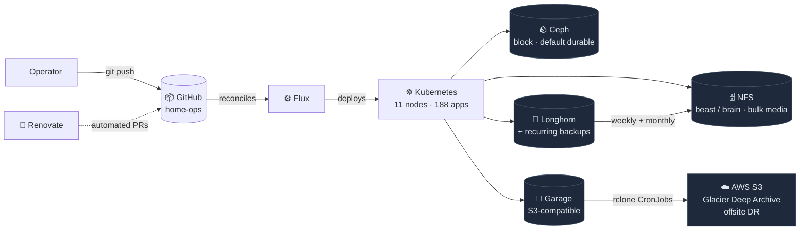
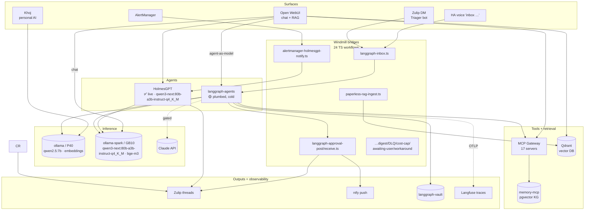

# Lovenet Home Operations Repository

_Production-grade Kubernetes for a household._
**GitOps** with Flux · **Automated dependency updates** with Renovate · **Self-hosted by design**

 

 

---

## 📖 Overview

This is the live configuration for a multi-node Kubernetes cluster that runs a household — home automation, security cameras, media, document management, AI workloads, and the operational tooling required to keep it all up. Every change lands in Git first; Flux reconciles the cluster from there, and Renovate keeps dependencies current via PRs.

The repo is GitOps-strict: applications are declared as `HelmRelease` resources, secrets are pulled from 1Password through External Secrets Operator, and clusters are mostly identical except for app selection and sizing. Operational quirks, durability tiers, and security defaults live alongside the manifests in [`.agents/instructions/`](https://github.com/rwlove/home-ops/tree/main/.agents/instructions) so the conventions are enforceable, not folklore.

---

## 🗺️ Architecture

Storage tiers are picked deliberately per workload — see [`storage-class.instructions.md`](https://github.com/rwlove/home-ops/blob/main/.agents/instructions/storage-class.instructions.md) for the decision tree.

---

## 🧰 Stack at a glance

| Layer            | Tool                                | Role                                                  |
|------------------|-------------------------------------|-------------------------------------------------------|
| **OS**           | CentOS Stream 9 / 10 (+ Ubuntu 24.04 on Spark) | Node operating system                      |
| **Runtime**      | cri-o + crun (containerd on Spark)  | CRI + OCI runtime; Spark is the lone containerd node  |
| **Kubernetes**   | v1.35.4                             | Control-plane and node version                        |
| **GPU**          | NVIDIA GPU Operator + Container Toolkit | P40 on worker8 (Pascal, 24 GB); GB10 on Spark (Grace-Blackwell, 128 GB unified) |
| **GitOps**       | Flux2                               | Declarative cluster reconciliation                    |
| **Automation**   | Renovate + GitHub Actions           | Dependency PRs, link checks, self-hosted runners     |
| **CNI**          | Cilium (eBPF)                       | Networking, BGP peering, LoadBalancer pool            |
| **Ingress**      | Envoy Gateway                       | L7 gateway / HTTPRoute                                |
| **Service mesh** | Istio                               | mTLS + traffic mgmt for mcp-system                    |
| **Admission**    | Kyverno                             | Namespace-delete blast-radius + audit-mode policies   |
| **DNS**          | external-dns                        | Cloudflare + bind9 split-horizon                      |
| **TLS**          | cert-manager                        | Let's Encrypt + internal CA                           |
| **Tunnel**       | cloudflared                         | Public ingress without exposing home WAN              |
| **AuthN/Z**      | Authelia + oauth2-proxy             | OIDC SSO; 24 oauth2-proxy instances gate apps         |
| **Secrets**      | External Secrets Operator + 1Password | 116 ExternalSecrets, zero plain-text in Git         |
| **VPN**          | wg-easy                             | Operator OOB WireGuard access                         |
| **Storage**      | Rook-Ceph, Longhorn, Garage, direct NFS | Tiered by durability requirement                  |
| **Databases**    | CloudNative-PG, Dragonfly, Qdrant   | 24 Postgres clusters, KV, vector                      |
| **Observability**| kube-prometheus-stack, Loki, Tempo, Grafana, HolmesGPT | Metrics, logs, traces, dashboards, AI alert triage |
| **Telemetry**    | OpenTelemetry Collector + Vector    | Trace pipeline (→ Tempo) + log shipping (→ Loki)      |
| **Images**       | ZOT                                 | Pull-through registry / local cache                   |

---

## 🖥️ Hardware

| Role | Hostname  | Device              | CPU | RAM   | OS         | Storage / Accelerators       | Notes                                 |
|------|-----------|---------------------|-----|-------|------------|------------------------------|---------------------------------------|
| 🧠   | master1   | bare-metal          | 4   | 32 GB | CentOS 10  | NVMe (Longhorn)              | Intel iGPU · RTL-SDR · control plane  |
| 🧠   | master2   | VM on **beast**     | 3   | 12 GB | CentOS 9   |                              | virtualized control plane             |
| 🧠   | master3   | VM on **beast**     | 3   | 10 GB | CentOS 9   |                              | virtualized control plane             |
| 💪   | worker2   | ThinkCentre M910x   | 8   | 32 GB | CentOS 9   | NVMe (Longhorn + Ceph OSD)   | ZWA-2 Z-Wave dongle                   |
| 💪   | worker3   | ThinkCentre M910x   | 8   | 64 GB | CentOS 9   | NVMe (Longhorn + Ceph OSD)   | Sonoff Zigbee dongle                  |
| 💪   | worker4   | ThinkCentre M910x   | 8   | 32 GB | CentOS 9   | NVMe (Longhorn + Ceph OSD)   | Coral USB TPU                         |
| 💪   | worker5   | VM on **beast**     | 10  | 24 GB | CentOS 9   | NVMe (Longhorn + Ceph OSD)   |                                       |
| 💪   | worker6   | VM on **beast**     | 10  | 30 GB | CentOS 9   | NVMe (Longhorn + Ceph OSD)   |                                       |
| 💪   | worker7   | VM on **beast**     | 10  | 30 GB | CentOS 9   | NVMe (Longhorn + Ceph OSD)   |                                       |
| 🎮   | worker8   | VM on **beast**     | 10  | 55 GB | CentOS 9   | NVMe (Longhorn + Ceph OSD)   | NVIDIA **P40** (24 GB VRAM)           |
| 🚀   | spark     | NVIDIA DGX Spark    | 20  | 128 GB| Ubuntu 24.04 | NVMe + 8 GPU slots         | NVIDIA **GB10** (Grace-Blackwell, 128 GB unified); arm64 · containerd outlier |

### Off-cluster infrastructure

| Host    | Role                                                                                          |
|---------|-----------------------------------------------------------------------------------------------|
| `beast` | Dell R730xd · iDRAC 8 · RAID6 bulk storage · primary NFS · Longhorn backup target · Garage substrate · VM host |
| `brain` | Router/gateway · RAID6 mass_storage · NFS for downloads & TV · OOB SSH on `:3231`              |

---

## 🌐 Network

<b>Physical topology</b> (click to expand)

 

| Network                                        | CIDR                  | VLAN |
|------------------------------------------------|-----------------------|------|
| Default                                        | `192.168.0.0/16`      | 0    |
| IoT                                            | `10.10.20.0/24`       | 20   |
| Guest                                          | `10.10.30.0/24`       | 30   |
| Security (cameras)                             | `10.10.40.0/24`       | 40   |
| Kubernetes pod subnet (Cilium)                 | `10.42.0.0/16`        | —    |
| Kubernetes services subnet (Cilium)            | `10.43.0.0/16`        | —    |
| Kubernetes LB pool (CiliumLoadBalancerIPPool)  | `10.45.0.0/24`        | —    |

Worker nodes attach to **iot** and **sec** VLANs via Multus for direct camera and IoT-device reachability. Cilium peers BGP with the upstream router to advertise the LB pool; external ingress flows through Envoy Gateway behind cloudflared.

---

## 📦 What's running

🏠 <b>Home Automation</b> — Home Assistant ecosystem, 400+ devices

| App | Purpose |
|-----|---------|
| **Home Assistant** | Primary orchestrator; 400+ Z-Wave / Zigbee / Matter / ESPHome devices |
| **ESPHome** | Build & deploy firmware for DIY sensors |
| **EMQX** | MQTT broker |
| **Node-RED** | Visual automation flows |
| **Zigbee2MQTT** | Zigbee bridge (Sonoff stick on worker3) |
| **Z-Wave JS UI** | Z-Wave bridge (ZWA-2 stick on worker1) |
| **Matter Server** | Matter protocol bridge |
| **Frigate** | NVR + ML camera analysis (7+ cameras, Frigate+ trained model) |
| **NetBox** | IPAM / DCIM |
| **wyoming-services** | Piper TTS + Whisper STT for voice |
| **smtp-relay** | Maddy → Mailgun outbound mail |

🎬 <b>Media & Entertainment</b> — Jellyfin, Immich, Music Assistant, RomM

| App | Purpose |
|-----|---------|
| **Jellyfin** | Primary media server (read-only metadata) |
| **Immich** + **immich-pet-tagger** + **immichkiosk** + **immich-power-tools** | Photo library with ML face/pet recognition, offsite-backed |
| **Music Assistant** + **Gonic** | Multi-room music control + Subsonic API |
| **RomM** | Retro game library (~10k ROMs) |
| **Beets** | Music library tagging |
| **cutVideo / av1corrector / videodupfinder / medialyze** | Custom video tooling |
| **Theme Park** | Consistent UI theming across apps |
| **Batocera Webdashboard Pro** | Retro-gaming console dashboard |
| **kodi-playback-watcher** | Bridge for Kodi playback state |

🤖 <b>AI & ML</b> — Local inference, agents, image generation (namespace <code>ai/</code>)

| App | Purpose |
|-----|---------|
| **Ollama** (P40) | Local LLM serving on the Pascal P40 (≤8b-class models, embeddings) |
| **Ollama Spark** | LLM serving on Spark/GB10 (qwen3-next:80b-a3b-instruct-q4_K_M for the agent fleet + HolmesGPT + Open WebUI, bge-m3 embeddings) |
| **ComfyUI** | Image generation workflows |
| **Khoj** + **khoj-oauth2-proxy** | Personal AI assistant over notes + docs (Authelia-gated) |
| **LangGraph Agents** | Custom multi-agent runtime (`rwlove/langgraph-agents`, version pinned in `helmrelease.yaml`); Postgres-checkpointed with live `task_queue` + `task_dlq` substrate; MCP-gateway client. See **AI architecture** section below. |
| **Langfuse** | LLM observability — OTLP trace sink for the langgraph-agents fleet (CNPG-backed; ClickHouse/Valkey/MinIO bundled) |
| **Paperless-AI** | Auto-tagging for paperless-ngx |
| **sync-receiver** | Cross-host AI state sync endpoint |
| **tei-spark** | Text-embedding-inference reranker (unsuspended 2026-05-21) |

📊 <b>Observability</b> — Prom/Loki/Grafana with AI triage on top

| App | Purpose |
|-----|---------|
| **kube-prometheus-stack** | Prometheus + AlertManager + node-exporter |
| **Loki** | Log aggregation |
| **Tempo** | Distributed tracing backend (SingleBinary mode) |
| **OpenTelemetry Collector** | Trace ingestion pipeline (apps → OTel → Tempo) |
| **Vector** | Log shipping (sources → Loki) |
| **Grafana** | Dashboards + alerting UI |
| **HolmesGPT** | LLM-backed alert investigation |
| **kube-state-metrics / kube-ops-view** | Cluster state & visualization |
| **Goldilocks** | VPA-driven resource right-sizing recommendations |
| **Kromgo** | Prometheus → Glance dashboard bridge |
| **Netdata** | Per-node real-time metrics |
| **network-ups-tools (NUT)** | UPS monitoring & graceful shutdown |
| **exporters** | Custom Prometheus exporters |

🗄️ <b>Data & Storage</b> — Databases, object storage, vector search

| App | Purpose |
|-----|---------|
| **CloudNative-PG** | 24 Postgres clusters with WAL archiving to Garage |
| **Dragonfly** | Redis-compatible in-memory store |
| **Qdrant** | Vector DB for embeddings / RAG |
| **pgAdmin** | Postgres admin UI |
| **Rook-Ceph** | Distributed block storage (default durable tier) |
| **Longhorn** | Block storage with NFS-backed recurring backups |
| **Garage** | S3-compatible object storage (DB backups, app S3 workloads) |

🌐 <b>Network, Auth & Platform</b> — Ingress, SSO, GitOps machinery

| App | Purpose |
|-----|---------|
| **Cilium** | CNI, BGP, LoadBalancer pool |
| **Envoy Gateway** | Ingress / HTTPRoute (30 routes) |
| **cert-manager** | TLS certificate lifecycle |
| **external-dns** | Cloudflare + bind9 record sync |
| **cloudflared** | Public tunnel without exposed WAN |
| **Authelia** | OIDC identity provider |
| **LLDAP** | Lightweight LDAP directory backing Authelia |
| **oauth2-proxy** | 24 instances gating per-app SSO |
| **wg-easy** | Primary OOB WireGuard access |
| **External Secrets Operator** | 1Password-backed secret materialization |
| **Flux2** | GitOps reconciler |
| **Renovate** | Image & Helm chart update PRs |
| **Kuadrant** | MCP server gateway (Authelia-gated JWT) |
| **Kyverno** | Admission controller — namespace-delete blast-radius + audit-mode policies |
| **actions-runner-controller** | Self-hosted GitHub Actions runners |
| **ZOT** | Pull-through registry cache |

🗂️ <b>Documents & Collaboration</b> — Personal knowledge stack + self-hosted tools

| App | Purpose |
|-----|---------|
| **Paperless-ngx** | Document scanning, OCR, tagging (CNPG-backed, offsite-backed) |
| **Obsidian** + **obsidian-couchdb** | Notes sync (CouchDB w/ Cloudflare rate-limiting) |
| **Zulip** | Self-hosted team chat (also wired into agent pipeline approvals) |
| **Windmill** | Workflow automation; 24 checked-in TypeScript flows under `kubernetes/apps/home/windmill/workflows/` cover AlertManager → HolmesGPT, langgraph inbox/approval/digest/DLQ/cost-cap/awaiting-user/reviewer-weekly, weekly operator drift sweeps (storage / network / ml / observability), paperless RAG ingest+tombstone (Qdrant) and LightRAG graph-RAG ingest+tombstone, Zulip triager webhook, the workaround upstream-watcher, and the errand-runner approval-flow smoke driver |
| **ntfy** | Self-hosted push notifications (operator approvals via Android tap actions) |
| **BentoPDF** | Self-hosted PDF toolkit |
| **Kitchenowl** | Shopping lists + recipe / meal management |
| **Open WebUI** | Self-hosted LLM frontend; routes chat to Ollama-Spark (default) / Ollama-P40, surfaces langgraph agents as selectable models, and pulls in HolmesGPT + the MCP gateway as tool servers. RAG via bge-m3 + bge-reranker-v2-m3 over Qdrant |
| **SearXNG** | Privacy-respecting metasearch engine |
| **Glance** | Personal dashboard / start page |
| **Atuin** | Encrypted shell-history sync across machines |
| **IT-Tools** | Self-hosted developer toolbox |
| **MediKeep** | Personal medical records |
| **Nametag** | Name tag / badge generator |
| **Pump** + **Pump-cv** | Custom personal apps (`rwlove`-built) |

🔌 <b>MCP Servers</b> — 19 Model Context Protocol servers behind an Authelia-gated gateway

| Server | Exposes |
|--------|---------|
| **mcp-gateway** | Aggregating gateway; Envoy SecurityPolicy validates Authelia-issued JWTs (daily-rotated key) |
| **ha-mcp** | Home Assistant entities + service calls |
| **esphome-mcp** | ESPHome dashboard: device YAML edit, validate, logs, compile + OTA flash |
| **immich-mcp** | Immich library search + asset metadata |
| **kubectl-mcp** | Cluster introspection + safe `kubectl` ops |
| **grafana-mcp** | Grafana dashboards + Loki/Prom queries |
| **prometheus-mcp** | Direct PromQL access |
| **paperless-mcp** | Paperless-ngx document search |
| **netbox-mcp** | NetBox IPAM / DCIM |
| **github-mcp** | GitHub repo + PR ops |
| **omada-mcp** | TP-Link Omada controller |
| **searxng-mcp** | Privacy search through SearXNG |
| **arr-mcp** | Library-search interface to media-pull apps |
| **time-mcp** | Time / timezone utilities (`rwlove/time-mcp` native-SHTTP build) |
| **chrome-mcp** | Playwright-driven Chromium browser automation for agents |
| **memory-mcp** | Cross-agent knowledge graph backed by Postgres + pgvector (bge-m3 1024-dim) |
| **cilium-mcp** | Read-only Cilium / Hubble introspection (kubectl-mcp-style, Cilium-scoped) |
| **windmill-mcp** | Aggregated Windmill workspace tools (script run, flow trigger) |
| **codegraph-mcp** | Code knowledge-graph queries (CodeGraphContext via `mcp-proxy --stateless`) |

---

## 🧠 AI architecture (overview)

Local-first by default — chat, agents, retrieval, alert triage, doc
ops — with explicit, separately-gated escape hatches to Claude API
and Claude Code when a task genuinely needs cloud capacity.

> 📖 **Full chapter**: see [`docs/src/ai_architecture.md`](https://github.com/rwlove/home-ops/blob/main/docs/src/ai_architecture.md)
> for per-app integration paths, RAG pipelines, escalation matrix, and the file:line
> references behind every claim here.

Dashed lines mark cold paths: `ENABLE_CLAUDE_API: false` today on
langgraph-agents; OTLP exporter fires only once Langfuse keys land
in 1Password.

### Surfaces, agents, and bridges

- **Open WebUI** (`collab/`) — primary chat UI. Defaults to qwen3-next:80b-a3b-instruct-q4_K_M on Ollama-Spark; users can switch to any langgraph agent via the OpenAI-compatible API. RAG runs over Qdrant with bge-m3 embeds + BGE reranker-v2-m3 in-process. Tool servers wired in: HolmesGPT + the MCP gateway.
- **Khoj** (`ai/`) — parallel personal-AI surface for notes + docs. Self-contained: own embedding pipeline (default gte-small, optionally ollama nomic-embed-text), chat via Ollama-P40. Does **not** consume MCP gateway or langgraph-agents.
- **HolmesGPT** (`observability/`) — live in production for alert triage. AlertManager firings reach it via Windmill's `alertmanager-holmesgpt-notify.ts`; it reasons over Prometheus + Loki + cluster state and posts a root-cause hypothesis to Zulip / ntfy. Open WebUI also surfaces it as a tool server. Prompt + context budget tuned for qwen3-next:80b-a3b-instruct-q4_K_M on Spark (32K context, 6 tool-call budget per investigation).
- **langgraph-agents** (`ai/`) — the FastAPI multi-agent runtime (`rwlove/langgraph-agents`, version pinned in `helmrelease.yaml`). Plumbed end-to-end (Postgres checkpoints + memory, live task-queue substrate in `postgres-langgraph-checkpoints`, vault PVCs, Windmill approval loop, cost caps in env). Trigger surface live: alertmanager → 6 namespace-mapped operators, daily 22:00 ET historian digest, weekly Saturday operator drift crons (ml / observability / network / reviewer / storage), errand-runner approval-flow smoke. `ENABLE_CLAUDE_API: false` so Claude API escalation is still gated. Public ingress splits CLI traffic (`hai.${SECRET_DOMAIN}`, Bearer-only) from browser traffic (`hai-web.${SECRET_DOMAIN}`, Authelia).
- **Windmill** (`home/`) — 24 checked-in TypeScript flows under `kubernetes/apps/home/windmill/workflows/` are the bridges that knit the surfaces above together. Every alert webhook, Zulip-triggered DM, approval round-trip, daily digest, weekly vault-hygiene sweep, weekly operator drift sweeps (storage / network / ml / observability), DLQ retry, cost-cap pause, Paperless RAG ingest (Qdrant + LightRAG graph-RAG), and the errand-runner approval-flow smoke driver is a `.ts` file there.
- **Langfuse** (`ai/`) — OTLP trace sink for langgraph-agents. Chart deploys ClickHouse + Valkey + MinIO bundled; Postgres comes from CNPG `postgres-langfuse`.
- **memory-mcp** (`mcp-system/`) — cross-agent knowledge graph on `postgres-langgraph-memory` with pgvector(1024). bge-m3 embeds via Ollama-Spark.

### Agent fleet — activation status

| Agent                  | Role                                                       | Status |
|------------------------|------------------------------------------------------------|--------|
| `HolmesGPT`            | AlertManager-driven root-cause investigation               | ✅ live |
| `triager`              | Classifies inbound items, assigns owner agent              | ✅ live · default route for every untargeted `/inbox` |
| `supervisor`           | Routes work to specialist agents; opens approvals          | ✅ live · in-graph fallback |
| `historian`            | Activity log curator + daily/weekly/monthly accomplishment digests | ✅ live · daily 22:00 ET cron |
| `reporter`             | Universal final hop — composes user-facing DM from upstream agent output | ✅ live · in-graph terminus |
| `reviewer`             | Vault hygiene: aging TODOs, drift findings, dead `[[wiki-links]]` | ✅ live · weekly Sat 06:00 ET cron |
| `storage-operator`     | Ceph + Longhorn + Garage + CNPG + Barman + NFS planning    | ✅ live · alertmanager + weekly Sun 07:00 ET cron |
| `network-operator`     | Lovenet L1–L7 ops (Omada SDN, Cilium BGP, VLANs, DNS, certs) | ✅ live · alertmanager + weekly Sat 04:00 ET cron |
| `observability-operator` | Prometheus rules, AlertManager routing, Loki, Grafana, HolmesGPT prompt tuning | ✅ live · alertmanager + weekly Sat 03:00 ET cron |
| `ml-operator`          | Frigate, Immich CLIP, model tuning, GPU placement          | ✅ live · alertmanager + weekly Sat 02:00 ET cron |
| `smart-home-operator`  | Home Assistant entities, automations, ESPHome configs      | ✅ live · alertmanager + intent-drift cron |
| `homelab-engineer`     | Cluster ops, HelmRelease drafting, PR-shaped output        | ✅ live · alertmanager default-route |
| `researcher`           | Web + repo + vault research                                | ✅ live · hourly renovate-triage cron |
| `errand-runner`        | Class C+ MCP-write executor (the only agent that calls MCP write) | ✅ live · in-graph after approval · local-only |
| `note-maker`           | Captures decisions + facts back into the vault             | 🟡 reachable via `/inbox` (HA voice "inbox …"); no recurring trigger |
| `coder`                | Code reading, drafting, PR descriptions                    | 🟡 reachable via `/inbox`; no recurring trigger |
| `security`             | Surveillance + physical-security analyst (Frigate triage)  | 🟡 cold · needs Frigate HTTP client wiring |
| `auditor`              | CVE + vulnerability researcher (kubectl + OSV + GH Advisory) | 🟡 cold · needs OSV/GHSA client wiring |
| `artist`               | Image generation via ComfyUI MCP                           | 🟡 cold · needs ComfyUI MCP allowlist populated |
| `property-coordinator` | 3532 Foxhall workstreams (contractors, deck, pool)         | 🟡 cold · ad-hoc `/inbox` only |
| `health-tracker`       | Personal health tracking                                   | 🟡 cold · local-only |
| `doc-writer` (Scribner) | Sweeps repos for stale docs; drafts README + `docs/` patches as diffs when commits land | 🟥 aspirational |

✅ live · 🟡 wired but not on a recurring trigger or blocked on tool wiring · 🟥 not built

**Tool-binding gap (load-bearing caveat):** All ✅-live agents above use `with_structured_output()` against the prompt content they receive. Only `errand-runner` actually calls MCP at runtime. Operator weekly drift crons produce LLM reasoning over the prompt — they do NOT dynamically query Prometheus / kubectl / Omada / etc. (the MCP allowlists exist, but the LLM call doesn't bind them as tools). Adding ReAct-style tool-binding to an agent is a deferred architectural step.

`health-tracker` and `errand-runner` are pinned local-only at the
routing layer — they never escalate to Claude API regardless of agent
uncertainty, because the data class isn't suitable for off-site
inference.

### Local-first routing tiers

| Tier | Backend                              | When used                                                  |
|------|--------------------------------------|------------------------------------------------------------|
| 1    | `qwen2.5:7b` on Ollama (P40)         | Fast / simple agents (`triager`, `note-maker` drafts)      |
| 2    | `qwen3-next:80b-a3b-instruct-q4_K_M` on Ollama-Spark (GB10) | Default chat + agent inference + HolmesGPT                 |
| 3    | Claude API (langgraph escalation)    | Explicit uncertainty markers, repeated local-retry failure, novel/long-context, or `requires_cloud` tag. Cost caps `$5/task` · `$10/agent/day` · `$30/global/day` enforced inside the cluster |

### Voice-to-action: power button → HA Assist → agents → Obsidian

The most common way work enters the fleet — hold the phone's power button, say "inbox &lt;whatever I'm thinking&gt;", and the cluster takes it from there.

```mermaid
flowchart LR
    Btn[📱 Hold power button<br/>Pixel: 'Hold for Assistant'] --> Assist[HA Companion app<br/>set as default assistant]
    Assist -->|audio stream| HA[Home Assistant<br/>Assist pipeline]
    HA --> Whisper[Whisper STT<br/>wyoming-services on P40]
    Whisper --> Sentence[Sentence trigger:<br/>'inbox &#123;content&#125;']
    Sentence --> Ollama[conversation.ollama_voice<br/>qwen3:8b]
    Ollama --> Rest[HA rest_command<br/>POST + Authelia JWT]
    Rest --> Hook[Windmill:<br/>langgraph-inbox.ts]
    Hook --> LG[langgraph-agents /inbox]
    LG --> Triage[triager classifies]
    Triage -->|capture only| Note[note-maker]
    Triage -->|plan + act| Spec[specialist agent<br/>drafts plan]
    Spec -->|needs input| Zulip[💬 Zulip approval<br/>+ ntfy push]
    Zulip -->|reply / tap| Receive[approval-receive]
    Receive --> Spec
    Spec --> Done[outcome to vault]
    Note --> Inbox[/vault/inbox/YYYY-MM-DD-…md/]
    Done --> Outputs[/vault/outputs/&#123;drafts,finals&#125;//]
    Inbox --> Couch[(obsidian-couchdb)]
    Outputs --> Couch
    Couch -->|LiveSync| Phone[📱 Obsidian on phone<br/>same vault]
```

#### The path

1. **Hold power button.** Pixel's "Hold for Assistant" gesture is bound to the HA Companion app as the default digital assistant. The Assist UI opens with the mic hot.
2. **Speak.** Audio streams to the cluster — no on-phone STT. The trigger phrase is `inbox <body>`; everything after `inbox` is the note.
3. **STT in cluster.** The Assist pipeline routes the audio to **Whisper** (`wyoming-services`, GPU-accelerated on the P40).
4. **Intent + LLM.** A sentence trigger matches `inbox {content}` and hands `{content}` to `conversation.ollama_voice` (qwen3:8b on Ollama, tool-calling enabled). The conversation agent's only job here is to confirm the intent and call the rest_command — it does not interpret the content.
5. **Auth'd POST.** An HA `rest_command` POSTs to `https://langgraph-inbox.${SECRET_DOMAIN}/webhook` with `{ source:"voice", user:"rob", content:"<transcript>" }`. The request carries an **Authelia client_credentials JWT** issued to a dedicated `ha-voice-inbox` OIDC client — same daily-rotated signing-key machinery the MCP gateway already uses. Envoy's `SecurityPolicy` validates the JWT against Authelia's JWKS at the gateway.
6. **Windmill `langgraph-inbox.ts`.** Normalizes the payload and POSTs to `/inbox` on `langgraph-agents`.
7. **Triager classifies.** Research question, household errand, homelab change, property task, or note-to-self — and picks the specialist agent.
8. **Capture path → note-maker writes the file** to `/vault/inbox/YYYY-MM-DD-HHMM-<slug>.md` on the `langgraph-vault-rw` PVC. Single writer, no race with the phone.
9. **Plan-and-act path → specialist drafts a plan** into Postgres + a draft under `/vault/outputs/drafts/`. HITL approval via the existing Zulip + Pushover loop when needed (see triggers above).
10. **Round-trip to the phone.** `obsidian-couchdb` watches the vault PVC and replicates new files through Self-hosted LiveSync — the note from step 8, plus any drafts/finals from step 9, appear in the Obsidian app on the phone within a sync cycle. Same surface the dictation started on.

The loop closes locally and on one surface: power-button → speak → outcome appears in the vault. Whisper, Ollama, Windmill, and the agents all run in the cluster; the only off-site dependency is `claude.com` if the local fleet escalates a task.

### Alert triage (production today)

HolmesGPT is the one agent already running in production:

- **AlertManager → Windmill `alertmanager-holmesgpt-notify.ts` → HolmesGPT** on every firing alert
- HolmesGPT queries Prometheus, Loki, and the cluster directly to build a root-cause hypothesis
- Result posted back as a Pushover message + Zulip thread; the Windmill workflow sanitizes raw tool-call descriptors out of the agent text before delivery

### Current state (2026-05-23)

- **HolmesGPT** — live, handling cluster alerts daily on Ollama-Spark / qwen3-next:80b-a3b-instruct-q4_K_M.
- **LangGraph fleet** — 21 specialist agents plumbed end-to-end but cold (`ENABLE_CLAUDE_API: false`, no production triggers). Public ingress split into CLI (`hai.${SECRET_DOMAIN}`, Bearer) and browser (`hai-web.${SECRET_DOMAIN}`, Authelia). Gated on the Claude API key + a cluster-confidence sign-off; the Spark migration that was the prior gate completed 2026-05-20.
- **claude-runner** — retired 2026-05-23. Superseded by the langgraph fleet; the two CronJobs (PR triage + cost-cap commentary) graduated into agent workflows inside langgraph-agents.
- **KubeClaw** — retired (memo `project_open_issues_cleanup_2026_05_20`).

---

## ☁️ Cloud dependencies

| Service                                          | Use                                                              | Cost              |
|--------------------------------------------------|------------------------------------------------------------------|-------------------|
| [1Password](https://1password.com/)              | Secret backend for External Secrets                              | ~$65 / yr         |
| [Cloudflare](https://www.cloudflare.com/)        | Domain, DNS, tunnel, WAF rate-limiting                           | Free              |
| [GitHub](https://github.com/)                    | Repo hosting + CI                                                | Free              |
| [Mailgun](https://www.mailgun.com/)              | Outbound mail relay (via Maddy)                                  | Free (Flex)       |
| [Pushover](https://pushover.net/)                | Push notifications for AlertManager + apps                       | $10 one-time      |
| [Frigate+](https://plus.frigate.video/)          | Trained ML model for Frigate NVR                                 | $50 / yr          |
| [AWS S3 Glacier Deep Archive](https://aws.amazon.com/glacier/) | Offsite DR for Immich + Paperless (objects + DB backups) | ~$1–5 / mo (varies) |
|                                                  |                                                                  | **~$10–15 / mo**  |

---

## 🛡️ Operational pillars

### 💾 Tiered storage durability

Four tiers, picked by what the data has to survive — node loss, Ceph loss, cluster loss, or full site loss. Databases get `ceph-block` + Barman→Garage; irreplaceable state goes to Longhorn with NFS-shipped weekly + monthly backups; S3-shaped workloads use Garage; bulk media rides direct NFS. Full decision tree: [`.agents/instructions/storage-class.instructions.md`](https://github.com/rwlove/home-ops/blob/main/.agents/instructions/storage-class.instructions.md).

### 🔐 Secrets — zero plain-text in Git

All 116 ExternalSecrets resolve through External Secrets Operator from 1Password. Application credentials are templated into `ExternalSecret` resources and never live in YAML. Cross-namespace mirrors use the reflector pattern when consumer charts hard-code secret names.

### 🪪 Authentication — single sign-on everywhere

Authelia (with LLDAP) is the OIDC identity provider; per-app oauth2-proxy instances enforce auth at Envoy Gateway. 24 apps sit behind SSO today. The mcp-gateway validates Authelia-issued JWTs with a daily-rotated signing key for MCP tooling.

### 🔭 Observability — metrics, logs, AI triage

kube-prometheus-stack scrapes everything; Loki ingests pod logs (via Vector); Tempo ingests traces (via OpenTelemetry Collector); Grafana stitches the dashboards. AlertManager fans alerts to ntfy and to **HolmesGPT**, which runs LLM-driven root-cause investigation against the cluster and posts findings back via Windmill.

### 🎮 GPU workloads

Two GPUs split the workload:

- **NVIDIA P40 on worker8** (Pascal, 24 GB VRAM) — Ollama for ≤8b-class models + embeddings, ComfyUI, Whisper STT, Immich CLIP face/pet recognition, and the immich-pet-tagger fork pinned to a P40-compatible PyTorch build.
- **NVIDIA GB10 on Spark** (Grace-Blackwell, 128 GB unified) — the larger Ollama deployment serving qwen3-next:80b-a3b-instruct-q4_K_M for the LangGraph agent fleet, HolmesGPT, and Open WebUI, plus bge-m3 embeddings for the cross-agent knowledge graph and Paperless RAG.

Driver lifecycle is handled by the NVIDIA GPU Operator. Spark is the lone containerd node in an otherwise CRI-O cluster; a NodeFeatureRule auto-skips the GPU container-toolkit DaemonSet on CRI-O nodes.

### 🛟 Disaster recovery

Per-app rclone CronJobs ship Immich originals and Paperless documents — plus their Garage-stored Postgres backups — to encrypted AWS S3 with a 1-day Glacier Deep Archive transition. Recovery procedure is documented at [Offsite recovery](https://rwlove.github.io/home-ops/offsite_recovery/) and was last validated 2026-05-05.

### 🌪️ Strict GitOps

Every change reaches the cluster through Git. Flux suspends are a deliberate manual signal — paused Kustomizations are not "broken," they're intentional pauses for in-flight maintenance and are documented in conventions, not reverted on sight.

---

## 📚 Documentation

The full operator handbook lives at **<https://rwlove.github.io/home-ops/>**.

Frequently referenced pages:

- [AI architecture](https://rwlove.github.io/home-ops/ai_architecture/)
- [Cluster rebuild](https://rwlove.github.io/home-ops/cluster_rebuild/)
- [Initialization & teardown](https://rwlove.github.io/home-ops/init_teardown/)
- [Cluster upgrade](https://rwlove.github.io/home-ops/cluster_upgrade/)
- [Power outage recovery](https://rwlove.github.io/home-ops/power-outage/)
- [Limits & requests philosophy](https://rwlove.github.io/home-ops/limits/)
- [Debugging playbook](https://rwlove.github.io/home-ops/debugging/)
- [Offsite recovery](https://rwlove.github.io/home-ops/offsite_recovery/)
- [Immich restore to new CNPG database](https://rwlove.github.io/home-ops/immich_cnpg/)
- [NVIDIA P40 GPU setup](https://rwlove.github.io/home-ops/p40/)
- [master1 etcd disk swap](https://rwlove.github.io/home-ops/master1_etcd_disk_swap/)
- [GitHub webhook](https://rwlove.github.io/home-ops/github_webhook/)

Repo-local conventions (auto-loaded by AI agents from [`.agents/instructions/`](https://github.com/rwlove/home-ops/tree/main/.agents/instructions)):

- Storage class selection · HelmRelease security defaults · ConfigMap layout · Sorting rules · Schema correction · Persona

---

## 🙏 Acknowledgements

Inspired by the [k8s-at-home](https://github.com/k8s-at-home) community. [@whazor](https://github.com/whazor) maintains the excellent [k8s-at-home search](https://nanne.dev/k8s-at-home-search/) — a great way to discover how others configure the same Helm releases.

This repo has been continuously reconciling itself since <b>March 2021</b>.

