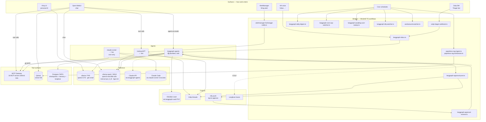
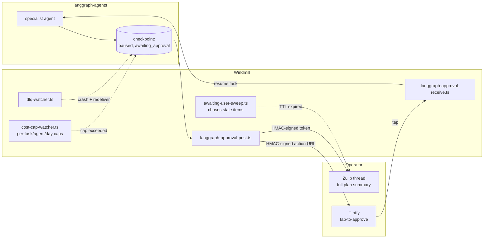

# AI Architecture

How AI work flows through the cluster — from the surface that takes
the request to the model that answers it, with every routing,
approval, and escalation hop named.

This chapter is **architectural**. Operational procedures
(how to trigger a job, where to look when a workflow stalls) live in
the vault runbook at `~/vaults/claude/runbooks/home-ops/workflow_automation.md`
per HOMELAB-SPEC Layer 2 #5.

## Big picture

Dashed lines mark cold paths (Claude API is gated; OTLP exporter
only fires once Langfuse keys are populated in 1Password).

## Ingress surfaces — what enters the cluster as work

| Surface | Transport | Lands at |
|---|---|---|
| HA voice ("inbox …") | Whisper STT → ollama_voice conversation → HA `rest_command` → Authelia-JWT POST | Windmill `langgraph-inbox.ts` (`kubernetes/apps/home/windmill/workflows/langgraph-inbox.ts:42`) |
| Zulip DM to Triager bot | Outgoing-webhook (bot_type=3) | Windmill `zulip-triager-webhook.ts` → forwards to `langgraph-inbox.ts` |
| Open WebUI chat | Browser → Authelia OIDC → Open WebUI backend | Routes to ollama-spark (default) or to a langgraph agent via OpenAI-compat API (`kubernetes/apps/collab/open-webui/app/helmrelease.yaml:41-46`) |
| Khoj UI | Browser → gateway extAuth (Authelia) → khoj | Khoj's own embedding pipeline; chat via ollama P40 |
| AlertManager firing alert | Webhook receiver | Windmill `alertmanager-holmesgpt-notify.ts` → HolmesGPT `/investigate` |
| Operator tap on ntfy | Action button → HMAC-signed URL | `langgraph-agents` `/approval` endpoint (`kubernetes/apps/ai/langgraph-agents/app/route-approval.yaml`) |
| Cron — daily digest / DLQ / cost-cap / awaiting-user / workaround | Windmill scheduled trigger | Each `.ts` workflow under `kubernetes/apps/home/windmill/workflows/` |
| Cron — Renovate PR triage / cost commentary | Kubernetes CronJob | `claude-runner` (`kubernetes/apps/automation/claude-runner/app/cronjob-*.yaml`) |

There are **12 Windmill TypeScript workflows** in the repo today;
they're all under `kubernetes/apps/home/windmill/workflows/`. There is
No legacy orchestration substrate; flows were ported during the ntfy/Zulip approval
migration.

## Inference backends

| Backend | Hardware | Service URL | Models | Notes |
|---|---|---|---|---|
| `ollama` | P40 (Pascal, 24 GB) on worker8 | `http://ollama.ai.svc.cluster.local:11434` | qwen2.5:7b, qwen3:8b (voice), bge-m3 (memory rebuild), gte-small/nomic-embed-text (khoj) | The pre-Spark generation. ≤8b chat, embeddings, voice STT/TTS pipeline support. |
| `ollama-spark` | GB10 (Grace-Blackwell, 128 GB unified) | `http://ollama-spark.ai.svc.cluster.local:11434` | qwen3-next:80b-a3b-instruct-q4_K_M (chat default), bge-m3 (1024-dim embeds) | The post-Spark workhorse. Open WebUI default; HolmesGPT model; langgraph-agents default for memory embeds. |
| Claude API | Anthropic-hosted | langgraph-agents only, gated | per-task | Off by default — `ENABLE_CLAUDE_API: "false"` (`kubernetes/apps/ai/langgraph-agents/app/helmrelease.yaml:36`). Cost caps `$5/task`, `$10/agent/day`, `$30/global/day` (lines 54-56) enforced in code, not Anthropic's billing. |
| Claude Code | Anthropic-hosted, CLI | `claude-runner` only | per-task | `claude` CLI baked into `ghcr.io/rwlove/claude-runner:0.1.1`; called from CronJobs with `--max-turns 20`. |

Routing decisions belong in `langgraph-agents/.agents/instructions/hardware-routing.md`
(canonical) and `.agents/instructions/gpu-routing.md` in this repo
(local pointer + cluster-specific facts).

## RAG paths

Three distinct retrieval pipelines exist today. They share the Spark
embedder (bge-m3) but otherwise don't overlap.

### Open WebUI RAG

User-facing chat with retrieval over Open WebUI's own collections,
plus web search.

- **Embedder**: bge-m3 via ollama-spark (`kubernetes/apps/collab/open-webui/app/helmrelease.yaml:58`).
- **Reranker**: BGE reranker-v2-m3 in-process, sentence-transformers on CPU (line 66). Adds ~2.5 GiB to the pod's resident set.
- **Vector DB**: Qdrant at `http://qdrant.databases.svc.cluster.local:6333` (line 69).
- **Web search**: SearXNG (`collab.svc.cluster.local:8080`) via `RAG_WEB_SEARCH_ENGINE=searxng` (line 68).
- **Tool servers** also wired in: HolmesGPT (`observability.svc.cluster.local:8080/openapi.json`) and MCP gateway (`mcp-system.svc.cluster.local:8080/mcp`) — both visible to chat as callable tools (lines 88-112).

Phase A bge-m3 cutover (2026-05-20, PR #11792) showed bge-m3 (1024-dim)
beat nomic-embed-text (768-dim) by +23 MRR@10 pts on a 50-doc Paperless
eval. The cluster moved to bge-m3 for new embedding work.

### Khoj — personal AI assistant

A parallel RAG surface aimed at notes + the operator's documents, not
the agent fleet.

- **Embedder**: configured post-bootstrap in `/server/admin` →
  `SearchModelConfig`. Default is `thenlper/gte-small` (~130 MB) pulled
  from HuggingFace into the `khoj-models` PVC. Can be flipped to ollama
  nomic-embed-text via the admin UI by setting `api_type=OPENAI`.
- **Chat**: `qwen2.5:7b` on P40 ollama (`kubernetes/apps/ai/khoj/app/helmrelease.yaml:71-72`).
- **Web search**: SearXNG (`kubernetes/apps/ai/khoj/app/helmrelease.yaml:64`).
- **Storage**: two RWO PVCs — `khoj-config` (config + Django state) and `khoj-models` (HF embedding model cache).

Khoj does **not** consume the MCP gateway or langgraph-agents. It is a
self-contained personal-AI app.

### Paperless RAG ingest

Document-store-to-vector-store pipeline run by Windmill, not by any
agent.

- **Source**: paperless-ngx via API token (`PAPERLESS_TOKEN` whitelisted
  for Windmill workers at `kubernetes/apps/home/windmill/app/helmrelease.yaml:77`).
- **Ingest**: `paperless-rag-ingest.ts` pulls new/changed docs, embeds
  via ollama-spark bge-m3, writes to Qdrant.
- **Tombstone**: `paperless-rag-tombstone.ts` removes vectors for
  deleted docs.
- **Vector DB**: Qdrant — same instance Open WebUI uses, with separate
  collections.

There is currently a known gap: Open WebUI's Knowledge UI manages its
own collection namespacing and does not directly read the
Windmill-ingested `paperless` collection. Operator-side access is via
`paperless-mcp` (the MCP server), not Open WebUI's KB UI.

### memory-mcp knowledge graph

Cross-agent shared memory, not user-facing.

- **Backend**: CNPG cluster `postgres-langgraph-memory` with pgvector
  (1024-dim column).
- **Embedder**: bge-m3 via ollama-spark
  (`kubernetes/apps/ai/langgraph-agents/app/helmrelease.yaml:47-48`).
- **Surface**: `memory-mcp` MCP server (`kubernetes/apps/mcp-system/memory-mcp/`),
  exposed through the gateway.
- **Writers**: langgraph-agents writes observations via direct SQL;
  Claude Code consumes the same KG via the MCP gateway (search +
  graph-walk tools).

## Agent fleet — status today

| Agent | Surface | Status | Notes |
|---|---|---|---|
| HolmesGPT | `holmesgpt.observability` | ✅ live | qwen3-next:80b-a3b-instruct-q4_K_M on ollama-spark; AlertManager-driven RCA; also a tool server for Open WebUI. Prompt + context budget tuned 2026-05-23 (32K context, 6 tool-call budget). |
| triager | langgraph-agents fleet | ✅ live | Default route for every untargeted `/inbox`. Voice ("inbox …") + Zulip-DM ingress. qwen2.5:7b on P40. |
| supervisor | langgraph-agents fleet | ✅ live | In-graph fallback router when a specialist rejects work. |
| reporter | langgraph-agents fleet | ✅ live | Universal in-graph terminus — every chain ends here, rendering raw state into user-facing markdown. |
| historian | langgraph-agents fleet | ✅ live | Daily 22:00 ET activity-log digest → Zulip `#digests`. Pinned via `target_agent` in `langgraph-daily-digest.ts`. |
| reviewer | langgraph-agents fleet | ✅ live | Weekly Sat 06:00 ET vault hygiene sweep (aging TODOs, drift findings, dead `[[wiki-links]]`). |
| storage-operator | langgraph-agents fleet | ✅ live | Alertmanager `rook-ceph` + `databases` namespaces + weekly Sun 07:00 ET drift sweep. |
| network-operator | langgraph-agents fleet | ✅ live | Alertmanager `network` namespace + weekly Sat 04:00 ET Lovenet drift sweep. |
| observability-operator | langgraph-agents fleet | ✅ live | Alertmanager `observability` namespace + weekly Sat 03:00 ET PrometheusRule/silence/flap drift. |
| ml-operator | langgraph-agents fleet | ✅ live | Alertmanager `ai` + `mcp-system` namespaces + weekly Sat 02:00 ET GPU/Ollama/Frigate drift. |
| smart-home-operator | langgraph-agents fleet | ✅ live | Alertmanager `home` + `collab` namespaces + intent-drift cron. |
| homelab-engineer | langgraph-agents fleet | ✅ live | Alertmanager default route for any unmapped namespace. |
| researcher | langgraph-agents fleet | ✅ live | Hourly renovate-triage cron (drafts a Zulip card per open Renovate PR). |
| errand-runner | langgraph-agents fleet | ✅ live | The only agent that calls MCP write (HA, paperless, etc.). Gated on signed approval token. |
| note-maker | langgraph-agents fleet | 🟡 wired | Reachable via `/inbox` (HA voice "inbox …"); no recurring trigger. |
| coder | langgraph-agents fleet | 🟡 wired | Reachable via `/inbox`; no recurring trigger. |
| security | langgraph-agents fleet | 🟡 cold | Needs Frigate HTTP client wiring (no Frigate MCP exists). |
| auditor | langgraph-agents fleet | 🟡 cold | Needs OSV.dev / GHSA HTTP client wiring (no direct query path). |
| artist | langgraph-agents fleet | 🟡 cold | Needs ComfyUI MCP allowlist populated (gateway deployed, agent's allowlist is intentional stub). |
| property-coordinator | langgraph-agents fleet | 🟡 cold | Ad-hoc `/inbox` only; no recurring trigger. |
| health-tracker | langgraph-agents fleet | 🟡 cold · local-only | Manual /inbox from Obsidian; data class restricts to local only. |
| doc-writer (Scribner) | langgraph-agents (planned) | 🟥 aspirational | Not built. Goal: drafts README + `docs/` patches as diffs when commits land. |

> **Tool-binding gap (load-bearing caveat).** Every ✅-live agent
> above except `errand-runner` uses `with_structured_output()`
> against the prompt content it receives — it reasons over text but
> does NOT dynamically query its MCP allowlist. Operator weekly
> drift crons produce LLM reasoning over the prompt, not
> data-grounded analysis. The per-agent MCP allowlist is the
> declared scope for *future* tool-binding (ReAct-style); the
> binding itself is the next architectural step. See
> `reference_agent_fleet_tool_binding_gap` in memory.

`health-tracker` and `errand-runner` are pinned local-only at the
routing layer — they never escalate to Claude API regardless of agent
uncertainty, because the data class is unsuitable for off-site
inference.

## Approval and escalation flow

The approval token is signed with `LANGGRAPH_APPROVAL_SIGNING_KEY`
(stored in 1Password, whitelisted into the Windmill worker env at
`kubernetes/apps/home/windmill/app/helmrelease.yaml:77-82`). Pre-signing
moved from approval-receive to approval-post during the ntfy migration
so the Android tap path doesn't have to wait for langgraph to come
back with a fresh token.

Cost caps fire **before** Claude API egress. The cap-watcher polls
`/admin/costs/today` on langgraph-agents and pauses additional
escalations once the daily threshold is breached — the spend ceiling
is enforced inside the cluster, not at the Anthropic billing layer.

## Claude API vs Claude Code — separate escalation lanes

| | Claude API (via langgraph) | Claude Code (via claude-runner) |
|---|---|---|
| Trigger | An agent step escalates because the local model failed, hit an uncertainty marker, or is tagged `requires_cloud` | Kubernetes CronJob fires at the scheduled hour |
| Caller | `langgraph-agents` agent step | `claude` CLI in `ghcr.io/rwlove/claude-runner` |
| Tool surface | MCP gateway via the agent's tool list | `claude-runner` image's baked-in MCP allowlist (`gh` + the gateway via cluster network) |
| Cost control | In-cluster cost-cap watchers (`$5/task`, `$10/agent/day`, `$30/global/day`) | Daily `cost-cap-commentary` CronJob projects monthly spend and surfaces an upgrade signal if trending past `$30/mo` |
| Activation gate | `ENABLE_CLAUDE_API` env flag | `ks.yaml` suspend gate + presence of `anthropic_api_key` in 1Password |
| State | Postgres-checkpointed in `postgres-langgraph-checkpoints` | Stateless per-run; workspace is `emptyDir` tmpfs |
| Output | Vault file + Zulip thread + Langfuse trace | One Zulip card per PR (pr-triage) or one summary card (cost-commentary) |

The two lanes do not consume each other. `claude-runner` does not call
langgraph-agents; it's a parallel reasoning surface that reads the
cluster directly via `gh` MCP and uses langgraph's `/admin/costs/today`
endpoint only as a data source.

Kill criteria for any `claude-runner` workflow (per
`kubernetes/apps/automation/claude-runner/README.md:40-47`):

- useful-card rate < 30% after 2 weeks
- zero acted-upon cards in 14 days
- > 5 unintended noise reactions in any 7-day window

Document the kill in the plan's changelog and remove the CronJob.

## Observability of the AI fleet

| Subject | Sink | Wired by |
|---|---|---|
| langgraph-agents traces | Langfuse (OTLP) | `LANGFUSE_INIT_PROJECT_PUBLIC_KEY` / `_SECRET_KEY` provisioned at first boot (`kubernetes/apps/ai/langfuse/app/helmrelease.yaml:146-157`); SDK in `langgraph-agents` reads them from 1Password |
| langgraph-agents metrics | Prometheus | `kubernetes/apps/ai/langgraph-agents/app/servicemonitor.yaml` + `prometheusrule.yaml` |
| HolmesGPT investigations | Pushover + Zulip | `alertmanager-holmesgpt-notify.ts` sanitizes the agent text before delivery |
| Ollama (both) | Prometheus | scraped via standard ollama exporter Service in the `ai` namespace |
| GPU utilization | Prometheus via DCGM | GB10's DCGM counters are mostly broken — use `POWER_USAGE` as the proxy (see `.agents/instructions/gpu-routing.md`) |
| Windmill workflows | Windmill's own UI + Loki | Workflow logs ship via Vector → Loki under the windmill namespace |
| claude-runner | Zulip stream `ops/pr-triage`, `ops/cost-cap-commentary` + CronJob events | No persistent state; useful-card rate is operator-observed |

### Langfuse storage substrate

Langfuse v3 needs four backends. The chart deploys three in-namespace
and uses the cluster's CNPG for Postgres:

- **Postgres** — CNPG `postgres-langfuse` (the chart's bundled bitnami
  postgresql is disabled; `helmrelease.yaml:30-36`). DSN consumed via
  the `uri` key in `postgres-langfuse-app`.
- **ClickHouse** — chart-bundled, default `ceph-block` storage.
- **Valkey (Redis)** — chart-bundled.
- **MinIO (S3)** — chart-bundled.

Subchart auth secrets all share `langfuse-secret`. The CNPG-generated
secret is mirrored into the `ai` namespace by emberstack reflector
(see `databases/cloudnative-pg/config/langfuse/cluster.yaml`).

## File reference (quick index)

- **Khoj** — `kubernetes/apps/ai/khoj/app/helmrelease.yaml`
- **khoj extAuth** — `SecurityPolicy` in `kubernetes/apps/ai/khoj/` (oauth2-proxy retired 2026-07-01, #12767)
- **langfuse** — `kubernetes/apps/ai/langfuse/app/helmrelease.yaml`
- **langgraph-agents** — `kubernetes/apps/ai/langgraph-agents/app/helmrelease.yaml`
- **ollama** (P40) — `kubernetes/apps/ai/ollama/app/`
- **ollama-spark** (GB10) — `kubernetes/apps/ai/ollama-spark/app/`
- **paperless-ai** — `kubernetes/apps/ai/paperless-ai/app/helmrelease.yaml`
- **sync-receiver** — `kubernetes/apps/ai/sync-receiver/`
- **tei-spark** — `kubernetes/apps/ai/tei-spark/` (unsuspended 2026-05-21, PR #11893; PrometheusRule added in PR #11906)
- **open-webui** — `kubernetes/apps/collab/open-webui/app/helmrelease.yaml`
- **holmesgpt** — `kubernetes/apps/observability/holmesgpt/app/helmrelease.yaml`
- **windmill** — `kubernetes/apps/home/windmill/app/helmrelease.yaml`
- **windmill workflows** — `kubernetes/apps/home/windmill/workflows/*.ts` (12 today)
- **claude-runner** — `kubernetes/apps/automation/claude-runner/`
- **MCP gateway** — `kubernetes/apps/mcp-system/mcp-gateway/`
- **MCP servers** — 16 sibling directories under `kubernetes/apps/mcp-system/`

## See also

- [MCP Fleet Observability](mcp_observability.md) — gateway internals,
  per-server health
- [Memory MCP — Cross-Agent Knowledge Graph](memory_mcp.md) — KG schema
  and ingest path
- [Workflow Automation: Agents, Approvals, and Push](workflow_automation.md)
  — operator runbook (lives in the vault)
- [Orchestration Substrate](orchestration_substrate.md) — why a real
  task queue is still the missing piece
- [Task Queue Substrate — design proposal](task_queue_substrate_design.md)
  — the candidates being weighed
- [TEI on Spark — reranker for RAG](tei_spark.md) — text-embedding-
  inference deployment (vault-canonical runbook)
