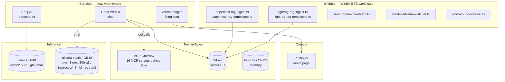

# AI Architecture

How AI work flows through the cluster — from the surface that takes
the request to the model that answers it, with every routing,
approval, and escalation hop named.

This chapter is **architectural**. Operational procedures
(how to trigger a job, where to look when a workflow stalls) live in
the vault runbook at `~/vaults/claude/runbooks/home-ops/workflow_automation.md`
per HOMELAB-SPEC Layer 2 #5.

## Big picture

> **2026-07-06:** the `langgraph-agents` fleet — the FastAPI multi-agent
> runtime this diagram used to show as the hub between every surface,
> Windmill bridge, and inference backend — was removed entirely, along
> with `sync-receiver`, the `postgres-langgraph-checkpoints` CNPG
> cluster, the `langgraph-vault` PVCs, and 16 Windmill workflows. The
> diagram below reflects what's actually running today; see
> [Agent fleet — status today](#agent-fleet--status-today) for the
> decommission detail.

```mermaid
flowchart TB
    subgraph Surfaces[Surfaces — how work enters]
        OWUI[Open WebUI<br/>chat]
        Khoj[Khoj UI<br/>personal AI]
        AM[AlertManager<br/>firing alert]
    end

    subgraph Bridges[Bridges — Windmill TS workflows]
        WPaperless[paperless-rag-ingest.ts<br/>paperless-rag-tombstone.ts]
        WLightrag[lightrag-rag-ingest.ts<br/>lightrag-rag-tombstone.ts]
        WIntent[smart-home-intent-drift.ts]
        WFail[windmill-failure-watcher.ts]
        WWork[workaround-watcher.ts]
    end

    subgraph Inference[Inference]
        OllamaP40[(ollama / P40<br/>qwen2.5:7b · gte-small)]
        OllamaSpark[(ollama-spark / GB10<br/>qwen3-next:80b-a3b-instruct-q4_K_M · bge-m3)]
    end

    subgraph Tools[Tool surfaces]
        Gw[MCP Gateway<br/>16 MCP servers behind Istio]
        Q[(Qdrant<br/>vector DB)]
        PG[(Postgres CNPG<br/>memory)]
    end

    subgraph Outputs[Outputs]
        Push[Pushover<br/>direct page]
    end

    OWUI -->|chat| OllamaSpark
    OWUI -->|tool calls| Gw
    OWUI --> Q
    Khoj --> OllamaP40
    AM --> Push

    WPaperless --> Q
    WLightrag --> Q
```

There are no dashed (cold-path) edges left in this diagram — the two
things that used to be dashed, langgraph's gated Claude API escalation
and its OTLP export to Langfuse, were both removed with the fleet.
Langfuse itself — the trace sink, with its bundled ClickHouse/Valkey/MinIO
and its dedicated CNPG Postgres cluster — was removed 2026-07-06. The
open keep-dormant-vs-remove question noted in earlier passes of this
chapter is now resolved: removed.

**Also gone: `claude-runner`, not by this decommission but by a chain
leading through it.** `claude-runner` (a CronJob-based Claude Code CLI
runner for Renovate PR triage + cost commentary) was retired
2026-05-23 — its function was absorbed into `langgraph-agents` at the
time. Now that langgraph-agents is also gone, that function is gone
twice over: `kubernetes/apps/automation/claude-runner/` does not exist
on disk today. The rest of this chapter still describes `claude-runner`
in several places below as if it were live CronJob-based infrastructure
— that content predates this pass and was not otherwise rewritten here
(out of scope for the langgraph-agents/HolmesGPT decommission this
edit covers), but it should be read as historical, not current state.
There is no automated Claude Code or Claude API pipeline in the
cluster today; Claude Code use is interactive-only.

**Known gap, not yet fixed:** HA voice ("inbox …") and the Zulip
Triager DM bot both used to be surfaces feeding this diagram — both
POSTed toward the now-deleted `/inbox` endpoint. The HA voice
`rest_command` (in the separate `home-assistant-config` repo) still
exists and will silently fail; the Zulip Triager webhook
(`zulip-triager-webhook.ts`) was deleted outright. Neither surface is
shown above because neither currently does anything.

## Ingress surfaces — what enters the cluster as work

| Surface | Transport | Lands at |
|---|---|---|
| HA voice ("inbox …") | Whisper STT → ollama_voice conversation → HA `rest_command` → Authelia-JWT POST | **Broken, not yet fixed.** The `rest_command` (in the separate `home-assistant-config` repo) still POSTs toward the Windmill `langgraph-inbox.ts` webhook, which was deleted 2026-07-06 along with the fleet it forwarded to. |
| Open WebUI chat | Browser → Authelia OIDC → Open WebUI backend | Routes to ollama-spark (default). The langgraph-agent-as-model registration was removed 2026-07-06 — Open WebUI's only remaining tool surface is the MCP gateway. |
| Khoj UI | Browser → gateway extAuth (Authelia) → khoj | Khoj's own embedding pipeline; chat via ollama P40 |
| AlertManager firing alert (`severity=critical`) | Webhook receiver | Pushover directly — no Windmill hop, no AI investigation step (the `windmill-investigate` route/receiver and `alertmanager-holmesgpt-notify.ts` were removed 2026-07-06) |
| Cron — RAG ingest/tombstone, HA intent drift, self-watch | Windmill scheduled trigger | The 8 surviving `.ts` workflows under `kubernetes/apps/home/windmill/workflows/` (paperless→Qdrant+LightRAG unified in `paperless-rag-fanout` since 2026-07-20) — see [Workflow Automation](workflow_automation.md) |
| Cron — Renovate PR triage / cost commentary | Kubernetes CronJob | `claude-runner` (`kubernetes/apps/automation/claude-runner/app/cronjob-*.yaml`) |

**Removed 2026-07-06, no longer ingress surfaces:** Zulip DM to the
Triager bot (`zulip-triager-webhook.ts` deleted) and operator taps on
ntfy for approval actions (`langgraph-agents` `/approval` endpoint
deleted). Neither has a replacement today.

There are **8 Windmill TypeScript workflows** in the repo today (down
from 23 — 16 scripts were deleted 2026-07-06: 14 `langgraph-*.ts`
fleet scripts plus `smoke-approval-flow.ts` and
`zulip-triager-webhook.ts`; then `paperless-rag-fanout.ts` was added
2026-07-20, unifying the two split RAG ingests, which remain on disk
with schedules paused for rollback); they're all under
`kubernetes/apps/home/windmill/workflows/`.

## Inference backends

| Backend | Hardware | Service URL | Models | Notes |
|---|---|---|---|---|
| `ollama` | P40 (Pascal, 24 GB) on worker8 | `http://ollama.ai.svc.cluster.local:11434` | qwen2.5:7b, qwen3:8b (voice), bge-m3 (memory rebuild), gte-small/nomic-embed-text (khoj) | The pre-Spark generation. ≤8b chat, embeddings, voice STT/TTS pipeline support. |
| `ollama-spark` | GB10 (Grace-Blackwell, 128 GB unified) | `http://ollama-spark.ai.svc.cluster.local:11434` | qwen3-next:80b-a3b-instruct-q4_K_M (chat default), bge-m3 (1024-dim embeds) | The post-Spark workhorse. Open WebUI default; memory-mcp's default for knowledge-graph embeds. |
| Claude Code | Anthropic-hosted, CLI | `claude-runner` only | per-task | `claude` CLI baked into `ghcr.io/rwlove/claude-runner:0.1.1`; called from CronJobs with `--max-turns 20`. |

**Removed 2026-07-06:** the langgraph-gated Claude API escalation lane
(`ENABLE_CLAUDE_API`, `$5/task`/`$10/agent/day`/`$30/global/day` cost
caps enforced in `langgraph-agents` code) — deleted along with the
fleet. There is no automated in-cluster path to the Claude API today.

Routing decisions belong in `.agents/instructions/gpu-routing.md` in
this repo. It used to defer to a "canonical" doc in the
`langgraph-agents` source repo, but that doc described langgraph's own
now-decommissioned per-agent routing factory — nothing was actually
cluster-wide there worth deferring to, so `gpu-routing.md` is now
self-sufficient.

## RAG paths

Three distinct retrieval pipelines exist today. They share the Spark
embedder (bge-m3) but otherwise don't overlap.

### Open WebUI RAG

User-facing chat with retrieval over Open WebUI's own collections,
plus web search.

- **Embedder**: bge-m3 via ollama-spark (`kubernetes/apps/collab/open-webui/app/helmrelease.yaml:58`).
- **Reranker**: BGE reranker-v2-m3 in-process, sentence-transformers on CPU (line 66). Adds ~2.5 GiB to the pod's resident set.
- **Vector DB**: Qdrant at `http://qdrant.databases.svc.cluster.local:6333` (line 69).
- **Web search**: SearXNG (`collab.svc.cluster.local:8080`) via `RAG_WEB_SEARCH_ENGINE=searxng` (line 68).
- **Tool server** also wired in: MCP gateway (`mcp-system.svc.cluster.local:8080/mcp`) — visible to chat as callable tools (lines 88-112). HolmesGPT's tool-server registration was removed 2026-07-06 along with the rest of the deployment.

Phase A bge-m3 cutover (2026-05-20, PR #11792) showed bge-m3 (1024-dim)
beat nomic-embed-text (768-dim) by +23 MRR@10 pts on a 50-doc Paperless
eval. The cluster moved to bge-m3 for new embedding work.

### Khoj — personal AI assistant

A parallel RAG surface aimed at notes + the operator's documents, not
the agent fleet.

- **Embedder**: configured post-bootstrap in `/server/admin` →
  `SearchModelConfig`. Default is `thenlper/gte-small` (~130 MB) pulled
  from HuggingFace into the `khoj-models` PVC. Can be flipped to ollama
  nomic-embed-text via the admin UI by setting `api_type=OPENAI`.
- **Chat**: `qwen2.5:7b` on P40 ollama (`kubernetes/apps/ai/khoj/app/helmrelease.yaml:71-72`).
- **Web search**: SearXNG (`kubernetes/apps/ai/khoj/app/helmrelease.yaml:64`).
- **Storage**: two RWO PVCs — `khoj-config` (config + Django state) and `khoj-models` (HF embedding model cache).

Khoj does **not** consume the MCP gateway. It is a self-contained
personal-AI app, and always was — it never consumed langgraph-agents
either, before that fleet was removed 2026-07-06.

### Paperless RAG ingest

Document-store-to-vector-store pipeline run by Windmill, not by any
agent.

- **Source**: paperless-ngx via API token (`PAPERLESS_TOKEN` whitelisted
  for Windmill workers at `kubernetes/apps/home/windmill/app/helmrelease.yaml:77`).
- **Ingest**: `paperless-rag-ingest.ts` pulls new/changed docs, embeds
  via ollama-spark bge-m3, writes to Qdrant.
- **Tombstone**: `paperless-rag-tombstone.ts` removes vectors for
  deleted docs.
- **Vector DB**: Qdrant — same instance Open WebUI uses, with separate
  collections.

There is currently a known gap: Open WebUI's Knowledge UI manages its
own collection namespacing and does not directly read the
Windmill-ingested `paperless` collection. Operator-side access is via
`paperless-mcp` (the MCP server), not Open WebUI's KB UI.

### memory-mcp knowledge graph

Cross-agent shared memory, not user-facing. Unaffected by the
2026-07-06 langgraph-agents decommission — this is memory-mcp's own
backend, not langgraph's.

- **Backend**: CNPG cluster `postgres-langgraph-memory` with pgvector
  (1024-dim column). The name predates the decommission; it's
  memory-mcp's database today, confirmed via `DATABASE_URL`,
  CNP egress, and the schema-init Job all referencing it
  independently of the now-deleted langgraph-agents.
- **Embedder**: bge-m3 via ollama-spark
  (`kubernetes/apps/mcp-system/memory-mcp/app/helmrelease.yaml:39-41`).
- **Surface**: `memory-mcp` MCP server (`kubernetes/apps/mcp-system/memory-mcp/`),
  exposed through the gateway.
- **Writers**: Claude Code and Open WebUI both write via the MCP
  gateway's memory-mcp tools (create-entity, add-observation,
  graph-walk, etc.). langgraph-agents used to write via direct SQL
  before it was removed 2026-07-06 — it's no longer a consumer or
  writer of any kind.

## Agent fleet — status today

**The entire langgraph-agents fleet below was removed 2026-07-06** —
the FastAPI runtime, its Postgres checkpoints, its vault PVCs, its
public routes, all of it. The table is kept as a historical record of
what the fleet's internal agent graph looked like; every row past
HolmesGPT describes a deleted thing. `memory-mcp` (separate app,
still live) and `postgres-langgraph-memory` (separate database, still
live) are unaffected — see [memory-mcp knowledge graph](#memory-mcp-knowledge-graph)
above.

| Agent | Surface | Status | Notes |
|---|---|---|---|
| HolmesGPT | — | ❌ removed 2026-07-06 | Deployment, RBAC, CNP, SecurityPolicy, and Open WebUI tool-server registration all deleted. No value delivered — see `kubernetes/apps/observability/holmesgpt/` in git history for the last-live manifests. |
| triager | langgraph-agents fleet | ❌ removed 2026-07-06 | Was the default route for every untargeted `/inbox`. Voice ("inbox …") + Zulip-DM ingress. qwen2.5:7b on P40. |
| supervisor | langgraph-agents fleet | ❌ removed 2026-07-06 | Was the in-graph fallback router when a specialist rejected work. |
| reporter | langgraph-agents fleet | ❌ removed 2026-07-06 | Was the universal in-graph terminus — every chain ended here, rendering raw state into user-facing markdown. |
| historian | langgraph-agents fleet | ❌ removed 2026-07-06 | Was a daily 22:00 ET activity-log digest → Zulip `#digests`, pinned via `target_agent` in the now-deleted `langgraph-daily-digest.ts`. |
| reviewer | langgraph-agents fleet | ❌ removed 2026-07-06 | Was a weekly Sat 06:00 ET vault hygiene sweep (aging TODOs, drift findings, dead `[[wiki-links]]`). |
| storage-operator | langgraph-agents fleet | ❌ removed 2026-07-06 | Was Alertmanager `rook-ceph` + `databases` namespaces + weekly Sun 07:00 ET drift sweep. |
| network-operator | langgraph-agents fleet | ❌ removed 2026-07-06 | Was Alertmanager `network` namespace + weekly Sat 04:00 ET Lovenet drift sweep. |
| observability-operator | langgraph-agents fleet | ❌ removed 2026-07-06 | Was Alertmanager `observability` namespace + weekly Sat 03:00 ET PrometheusRule/silence/flap drift. |
| ml-operator | langgraph-agents fleet | ❌ removed 2026-07-06 | Was Alertmanager `ai` + `mcp-system` namespaces + weekly Sat 02:00 ET GPU/Ollama/Frigate drift. |
| smart-home-operator | langgraph-agents fleet | ❌ removed 2026-07-06 | Was Alertmanager `home` + `collab` namespaces + intent-drift cron. |
| homelab-engineer | langgraph-agents fleet | ❌ removed 2026-07-06 | Was the Alertmanager default route for any unmapped namespace. |
| researcher | langgraph-agents fleet | ❌ removed 2026-07-06 | Was an hourly renovate-triage cron (drafted a Zulip card per open Renovate PR). |
| errand-runner | langgraph-agents fleet | ❌ removed 2026-07-06 | Was the only agent that called MCP write (HA, paperless, etc.), gated on signed approval token. |
| note-maker | langgraph-agents fleet | ❌ removed 2026-07-06 | Was reachable via `/inbox` (HA voice "inbox …"); no recurring trigger. |
| coder | langgraph-agents fleet | ❌ removed 2026-07-06 | Was reachable via `/inbox`; no recurring trigger. |
| security | langgraph-agents fleet | ❌ removed 2026-07-06 | Was cold — needed Frigate HTTP client wiring that was never built. |
| auditor | langgraph-agents fleet | ❌ removed 2026-07-06 | Was cold — needed OSV.dev / GHSA HTTP client wiring that was never built. |
| artist | langgraph-agents fleet | ❌ removed 2026-07-06 | Was cold — ComfyUI MCP allowlist was never populated. |
| property-coordinator | langgraph-agents fleet | ❌ removed 2026-07-06 | Was ad-hoc `/inbox` only; no recurring trigger. |
| health-tracker | langgraph-agents fleet | ❌ removed 2026-07-06 | Was cold, local-only; manual `/inbox` from Obsidian; data class restricted it to local only. |
| doc-writer (Scribner) | langgraph-agents (planned) | 🟥 never built | Was aspirational even before the decommission. Goal was: drafts README + `docs/` patches as diffs when commits land. Still not built, and now has no fleet to build it in. |

> **Tool-binding gap (historical, load-bearing while the fleet was
> live).** Every agent above except `errand-runner` used
> `with_structured_output()` against the prompt content it received —
> it reasoned over text but did NOT dynamically query its MCP
> allowlist. Operator weekly drift crons produced LLM reasoning over
> the prompt, not data-grounded analysis. See
> `reference_agent_fleet_tool_binding_gap` in memory for the full
> writeup; moot now that the fleet is gone, kept for anyone evaluating
> a future replacement.

## Approval and escalation flow (historical — removed 2026-07-06)

The entire approval loop below — the langgraph pause/resume state
machine, the two Windmill bridges, the Zulip `#approvals` stream, and
the ntfy tap-to-approve buttons — was removed with the fleet
2026-07-06. There is no replacement approval mechanism today because
there is no automated task pipeline producing anything to approve. See
[Workflow Automation § Historical design](workflow_automation.md#historical-design-as-originally-built)
for the full original design writeup (same diagram, kept there as the
canonical historical record so it isn't duplicated in two places).

Cost caps used to fire before Claude API egress, polling
`/admin/costs/today` on langgraph-agents — moot now; there is no
in-cluster Claude API lane to cap.

## Claude API vs Claude Code — separate escalation lanes

**The Claude API (via langgraph) column below was removed 2026-07-06**
along with the rest of the fleet — `ENABLE_CLAUDE_API`, the
per-task/agent/day cost caps, and `postgres-langgraph-checkpoints` are
all gone. There is no automated in-cluster path to the Claude API
today. The table is kept as a historical record of how the two lanes
compared when both existed; the Claude Code / `claude-runner` column
was not otherwise re-verified in this pass.

| | Claude API (via langgraph) — ❌ removed 2026-07-06 | Claude Code (via claude-runner) |
|---|---|---|
| Trigger | An agent step escalates because the local model failed, hit an uncertainty marker, or is tagged `requires_cloud` | Kubernetes CronJob fires at the scheduled hour |
| Caller | `langgraph-agents` agent step | `claude` CLI in `ghcr.io/rwlove/claude-runner` |
| Tool surface | MCP gateway via the agent's tool list | `claude-runner` image's baked-in MCP allowlist (`gh` + the gateway via cluster network) |
| Cost control | In-cluster cost-cap watchers (`$5/task`, `$10/agent/day`, `$30/global/day`) | Daily `cost-cap-commentary` CronJob projects monthly spend and surfaces an upgrade signal if trending past `$30/mo` |
| Activation gate | `ENABLE_CLAUDE_API` env flag | `ks.yaml` suspend gate + presence of `anthropic_api_key` in 1Password |
| State | Postgres-checkpointed in `postgres-langgraph-checkpoints` | Stateless per-run; workspace is `emptyDir` tmpfs |
| Output | Vault file + Zulip thread + Langfuse trace | One Zulip card per PR (pr-triage) or one summary card (cost-commentary) |

The two lanes never consumed each other. `claude-runner` did not call
langgraph-agents; it was a parallel reasoning surface that read the
cluster directly via `gh` MCP and used langgraph's
`/admin/costs/today` endpoint only as a data source — that data source
is gone along with everything else in the removed column above.

Kill criteria for any `claude-runner` workflow (per
`kubernetes/apps/automation/claude-runner/README.md:40-47`):

- useful-card rate < 30% after 2 weeks
- zero acted-upon cards in 14 days
- > 5 unintended noise reactions in any 7-day window

Document the kill in the plan's changelog and remove the CronJob.

## Observability of the AI fleet

| Subject | Sink | Wired by |
|---|---|---|
| Langfuse traces | Langfuse (OTLP) | ❌ **Removed 2026-07-06.** langgraph-agents was Langfuse's only trace source; with the producer already gone, Langfuse itself (app + bundled ClickHouse/Valkey/MinIO + its CNPG Postgres cluster) was removed too — the keep-dormant-vs-remove question is resolved as remove. |
| Critical AlertManager alerts | Pushover | Direct `pushover` receiver — no AI investigation step (HolmesGPT + `alertmanager-holmesgpt-notify.ts` removed 2026-07-06) |
| Ollama (both) | Prometheus | scraped via standard ollama exporter Service in the `ai` namespace |
| GPU utilization | Prometheus via DCGM | GB10's DCGM counters are mostly broken — use `POWER_USAGE` as the proxy (see `.agents/instructions/gpu-routing.md`) |
| Windmill workflows | Windmill's own UI + Loki | Workflow logs ship via Vector → Loki under the windmill namespace |
| claude-runner | Zulip stream `ops/pr-triage`, `ops/cost-cap-commentary` + CronJob events | No persistent state; useful-card rate is operator-observed |

**Removed 2026-07-06:** langgraph-agents traces/metrics rows (the
`ServiceMonitor` + `PrometheusRule` under
`kubernetes/apps/ai/langgraph-agents/` are gone along with the app).
The `claude-cost-rules` PrometheusRule (tracking
`langgraph_cost_usd_total` / `langgraph_calls_total` — langgraph's own
Anthropic spend instrumentation) was deleted too, along with the
AlertManager `claude-cost-warn`/`claude-cost-hard` routes. This is
unrelated to the separate, still-pending Claude Code CLI cost-governor
pipeline (a local script + systemd exporter outside this repo) — don't
conflate the two. Grafana dashboards `langgraph-agents.json`,
`aihomeops-state.json`, and `task-queue.json` were deleted;
`claude-code.json` (Claude Code CLI cost tracking, unrelated) is kept.

**Langfuse storage substrate — removed 2026-07-06.** Langfuse's
bundled ClickHouse, Valkey, and MinIO subcharts, plus its dedicated
CNPG Postgres cluster (`postgres-langfuse`), were deleted along with
the app itself. Nothing else in the cluster depended on any of it.

## File reference (quick index)

- **Khoj** — `kubernetes/apps/ai/khoj/app/helmrelease.yaml`
- **khoj extAuth** — `SecurityPolicy` in `kubernetes/apps/ai/khoj/` (oauth2-proxy retired 2026-07-01, #12767)
- **memory-mcp** — `kubernetes/apps/mcp-system/memory-mcp/app/helmrelease.yaml` (backed by CNPG `postgres-langgraph-memory`, still live)
- **ollama** (P40) — `kubernetes/apps/ai/ollama/app/`
- **ollama-spark** (GB10) — `kubernetes/apps/ai/ollama-spark/app/`
- **paperless-ai** — `kubernetes/apps/ai/paperless-ai/app/helmrelease.yaml`
- **tei-spark** — `kubernetes/apps/ai/tei-spark/` (unsuspended 2026-05-21, PR #11893; PrometheusRule added in PR #11906)
- **open-webui** — `kubernetes/apps/collab/open-webui/app/helmrelease.yaml`
- **windmill** — `kubernetes/apps/home/windmill/app/helmrelease.yaml`
- **windmill workflows** — `kubernetes/apps/home/windmill/workflows/*.ts` (8 today, down from 23)
- **claude-runner** — `kubernetes/apps/automation/claude-runner/`
- **MCP gateway** — `kubernetes/apps/mcp-system/mcp-gateway/`
- **MCP servers** — sibling directories under `kubernetes/apps/mcp-system/`

**Removed 2026-07-06** (no longer exist, no path to reference):
`kubernetes/apps/ai/langgraph-agents/`, `kubernetes/apps/ai/sync-receiver/`,
`kubernetes/apps/ai/langfuse/`, and
`kubernetes/apps/databases/cloudnative-pg/config/langfuse/`.

## See also

- [MCP Fleet Observability](mcp_observability.md) — gateway internals,
  per-server health
- [Memory MCP — Cross-Agent Knowledge Graph](memory_mcp.md) — KG schema
  and ingest path
- [Workflow Automation: Agents, Approvals, and Push](workflow_automation.md)
  — current state + historical design record of the removed approval loop
- [Orchestration Substrate](orchestration_substrate.md) — why a real
  task queue is still the missing piece (langgraph-agents was the
  closest thing to one; it's gone too now)
- [Task Queue Substrate — design proposal](task_queue_substrate_design.md)
  — superseded 2026-07-06; the evaluation assumed langgraph-agents' own
  Postgres checkpointer
- [TEI on Spark — reranker for RAG](tei_spark.md) — text-embedding-
  inference deployment (vault-canonical runbook)
