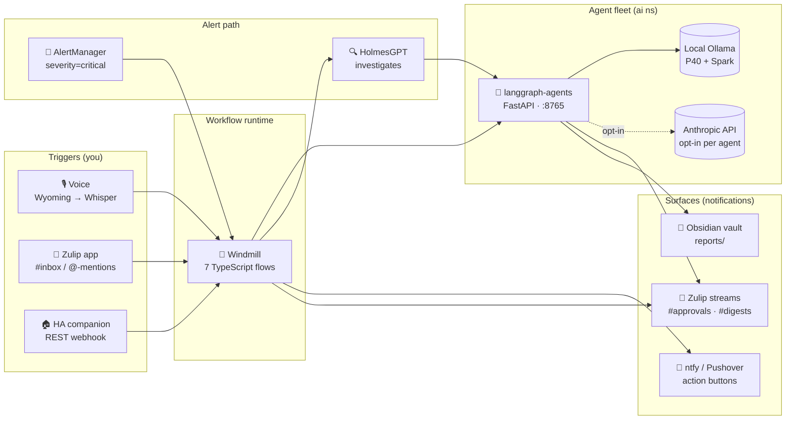
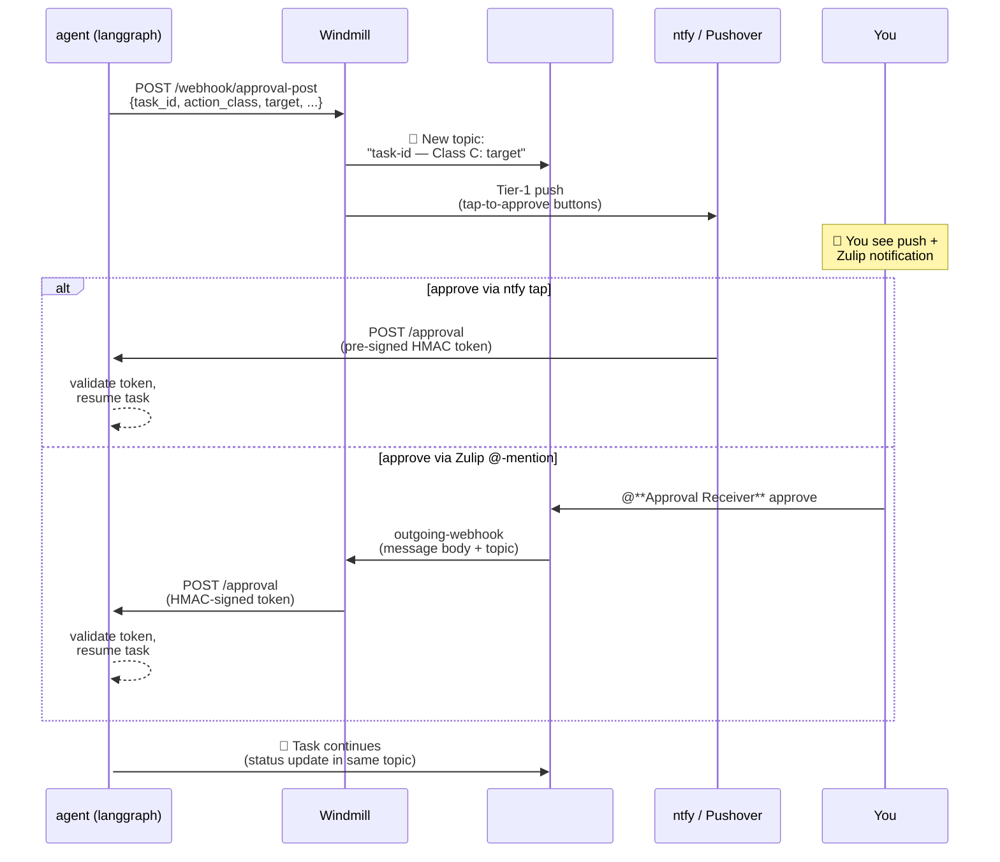

# Workflow Automation: Agents, Approvals, and Push

> **Authoritative maintainer**: the documentation agent owns keeping
> this page in sync with the cluster. If you spot drift, run the doc
> agent — don't hand-edit unless you also intend to update upstream
> sources.

This is the system that turns a voice memo, a Zulip ping, or a critical
AlertManager event into work done by a fleet of LLM agents — with a
human in the loop for anything risky, and a paper trail in the vault
for anything important.

## The system at a glance

Each block in **Workflow runtime** is a single TypeScript file checked
into `kubernetes/apps/home/windmill/workflows/`. They run in Deno
sandboxes inside the Windmill worker pods, with secrets injected via
the `windmill-workflows-secret` k8s Secret (sourced from 1Password).

The **agent fleet** is `langgraph-agents` — a FastAPI service in the
`ai` namespace. It exposes `/inbox` (submit a task), `/approval`
(answer a paused task), and `/admin/*` for housekeeping. Internally it
routes each agent to either a local Ollama backend (default) or the
Anthropic API (opt-in per agent, gated by daily cost cap).

## Triggering jobs from Android

Three first-class paths. All three end up POSTing to `/inbox` on
`langgraph-agents` — the difference is just the front door.

### Option 1 — Zulip mobile app (recommended for ad-hoc)

Send a direct message to the `triager-bot` in the Zulip app (the bot
named **Triager 📥**). The Zulip mobile app is a Play-Store install,
already logged in if you set it up before, and works over LTE without
needing the VPN.

What happens:
- Triager listens on a webhook → forwards your message to `/inbox`.
- The triager LLM classifies your task and routes to one of the
  specialist agents (coder, errand-runner, homelab-engineer,
  smart-home-engineer, etc.).
- If the agent can complete autonomously, it does so and posts the
  result to a topic in `#tasks` (Zulip stream).
- If the agent needs your approval, it pauses and you get a push
  notification (see [Approval flow](#approval-flow) below).

When to use: anything conversational. "Schedule the dishwasher to
run after 11pm tonight." "What's my power draw averaging this week?"
"Draft a reply to Joakim about the deck stain colors."

### Option 2 — Voice intake (Wyoming + Whisper)

The `wyoming-services` namespace runs Whisper for speech-to-text. The
Home Assistant companion app on Android has an "Assist" button that
records audio → posts to HA → routes to Whisper → forwards transcribed
text to Windmill's `/api/w/lovenet/jobs/run/p/f/lovenet/langgraph-inbox`
webhook → same `/inbox` as the Zulip path.

When to use: hands-free in the car, while cooking, or anytime typing
is friction. The Assist button is configurable as a phone shortcut
or a quick-action tile in the HA app's UI.

### Option 3 — Home Assistant companion app (templated tasks)

In the HA dashboard, add a button that calls the `windmill_inbox`
script (an HA `rest_command`). The button can pre-fill the task
content — useful for recurring asks like "give me today's energy
report" or "run the daily backups summary."

When to use: anything you do more than once a week and want as
one-tap. Less general than voice, more reliable than tapping through
the Zulip app.

## Approval flow

Some actions are dangerous enough that the agent shouldn't run them
alone. The fleet uses a four-class taxonomy:

| Class | Examples | Default behavior |
|---|---|---|
| **A** | Read-only queries; vault writes; status reports | Run autonomously |
| **B** | Idempotent ops with trivial undo (toggle a HA light, set a thermostat) | Run autonomously |
| **C** | Stateful changes with non-trivial undo (reschedule a recurring HA automation, edit Frigate zones, schedule a CronJob, push a draft message) | **Pause — needs approval** |
| **D** | Irreversible or high-blast-radius (delete data, send a real email/SMS, ship to PR, restart a service) | **Pause — needs approval; escalate to D only if undo_path is empty** |

When an agent proposes a Class C or D action, it pauses and emits an
**approval request**. You'll see it through two channels:

### Giving / rejecting approval

Two paths to the same outcome — pick whichever is in front of you:

- **From the push notification** (ntfy on Android, Pushover during
  the migration window): tap one of the action buttons:
  - **Approve** — resume the task
  - **Reject** — cancel the task; the agent will say so in the
    Zulip topic and not retry
  - **Defer 4h** — silence for 4 hours; sweep will re-notify at the
    4h mark
- **From Zulip** (mobile, desktop, or web): in the approval topic
  (named `<task_id> — Class C: <target>`), post one of:
  - `@**Approval Receiver** approve`
  - `@**Approval Receiver** reject`
  - `@**Approval Receiver** defer`

The two paths are equivalent and idempotent — once a decision is
recorded, follow-up attempts are no-ops.

### Escalation timeline

If you don't respond:

| Age | What happens |
|---|---|
| 30 min | Second push notification (tier-1 attention sound) |
| 4 h | Task marked "cold"; no further pushes; still resumable |
| 7 d | Auto-cancelled with reason `"7-day timeout"` (with a handful of per-agent exceptions; health-tracker never auto-cancels) |

The 30 min / 4 h / 7 d sweep is the `langgraph-awaiting-user-sweep`
Windmill flow, running every 5 minutes.

## Where results land

Different surfaces for different shapes of output:

- **Long-form deliverables** → the Obsidian vault, under
  `~/vaults/claude/reports/`. Daily digests, weekly summaries,
  research findings, draft emails — anything that's a document.
  The reporter agent writes these and tells you the filename via
  Zulip.
- **Status updates + acknowledgements** → the same Zulip topic as
  the approval request, so the conversation stays threaded.
- **Daily roll-up** → `#digests` stream, one topic per day named
  `daily-YYYY-MM-DD`. Auto-posted at 22:00 ET by the `daily-digest`
  cron flow.
- **Alert investigations** → push notification with HolmesGPT's
  ≤500-char root-cause summary + Zulip ack of the original alert.
- **Cost / state alerts** → push only (cost cap watcher, awaiting-
  user escalations).

If you want to dig deeper than the surface message:

- **Windmill UI** at `https://windmill.${SECRET_DOMAIN}` →
  workspace `lovenet` → Runs tab. Every execution has full args,
  return value, stdout, and timings.
- **langgraph-agents** at `https://agents.${SECRET_DOMAIN}` (auth-
  gated) → `/admin/tasks` for task state, `/admin/tasks/<id>` for
  the full state machine of a specific task.

## The seven Windmill workflows

| Workflow | Trigger | What it does |
|---|---|---|
| `alertmanager-holmesgpt-pushover` | Webhook (AlertManager `severity=critical`) | Calls HolmesGPT to investigate (≤2 tool calls, <500 chars); pushes the summary |
| `langgraph-inbox` | Webhook (Zulip bot, voice, HA companion) | Forwards to `/inbox`; if the task pauses, fans out an approval-post |
| `langgraph-approval-post` | Webhook (langgraph pause) | Posts approval request to Zulip `#approvals` + tier-1 push |
| `langgraph-approval-receive` | Outgoing-webhook (Zulip `@Approval Receiver`) | Verifies actor + emoji/keyword; HMAC-signs token; POSTs `/approval` |
| `langgraph-awaiting-user-sweep` | Cron (every 5 min) | Tier-1 push at 30m; mark cold at 4h; auto-cancel at 7d |
| `langgraph-cost-cap-watcher` | Cron (every 4 h) | Push if today's Anthropic spend ≥ 80% (warn) or 100% (cap-hit) |
| `langgraph-daily-digest` | Cron (22:00 ET) | Triggers the reporter agent to write today's digest + posts summary to `#digests` |

Source-of-truth on disk:
`kubernetes/apps/home/windmill/workflows/<name>.ts`. The Windmill DB
holds the runtime copy; we sync from git when scripts change.

## Operating notes

The system is mostly self-tending, but a few things will eventually
need attention:

- **HolmesGPT is slow** — each alert investigation takes ~5–7 min on
  P40-class Ollama hardware. If a burst of critical alerts fires,
  the workflow queue backs up but every job still runs eventually.
- **`/admin/tasks` hangs** on langgraph-agents (pre-existing,
  unrelated to Windmill). The awaiting-user-sweep tolerates this
  with a `{skip: true}` return; no errors, just a 5-min retry
  cadence until langgraph fixes the endpoint.
- **Push backend in transition** — Pushover (SaaS, paid) is being
  replaced with **ntfy** (self-hosted, tap-to-action buttons). The
  Zulip approval-receive path is unaffected; it stays as the
  reliable fallback.

See the migration write-up at
[`audit/n8n-to-windmill.md`](audit/n8n-to-windmill.md) (if present)
or memory `project_n8n_to_windmill_migration_done` for the history.
