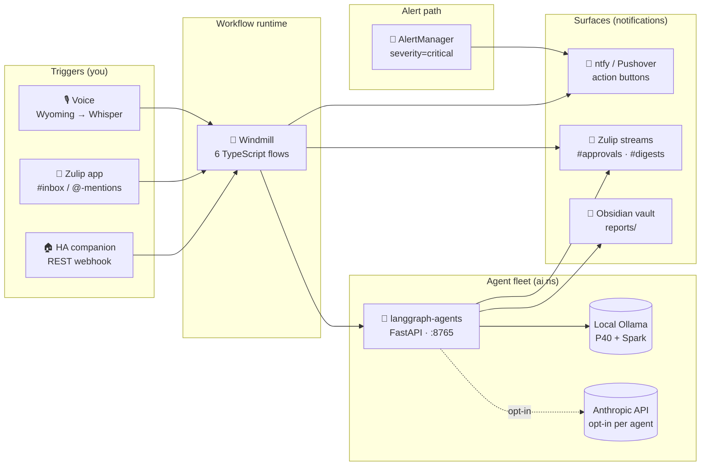
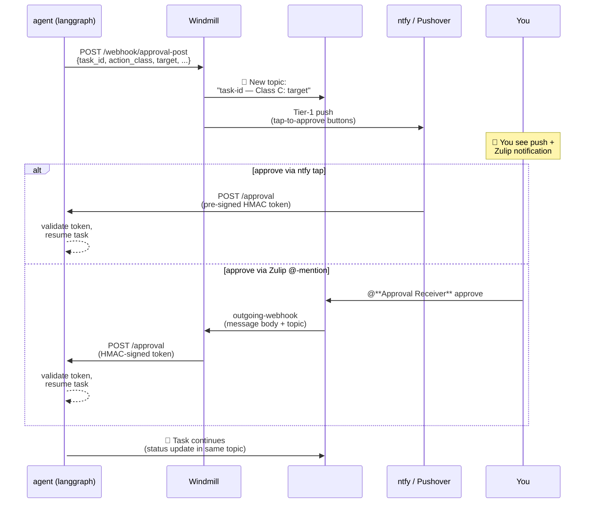

# Workflow Automation: Agents, Approvals, and Push

> **Status: decommissioned 2026-07-06.** The `langgraph-agents` fleet
> this page describes — its `/inbox` and `/approval` endpoints, the
> Zulip/ntfy/Pushover approval loop, and 16 of the Windmill workflows
> referenced below — was removed entirely
> (`kubernetes/apps/ai/langgraph-agents/`, `kubernetes/apps/ai/sync-receiver/`,
> the `postgres-langgraph-checkpoints` CNPG cluster, the `langgraph-vault`
> PVCs, and the `hai.${SECRET_DOMAIN}` / `hai-web.${SECRET_DOMAIN}`
> HTTPRoutes are all gone). See **Current state** below for what's
> actually running today; the rest of the page is kept as a historical
> record of the original design.

## Current state (2026-07-06)

- **No agent fleet.** `langgraph-agents` (the FastAPI service that
  used to live in the `ai` namespace) was deleted along with its
  Postgres checkpoints database, vault PVCs, and public routes. There
  is no `/inbox`, no `/approval`, no `/admin/tasks`.
- **Windmill is still deployed and still runs 7 workflows** — none of
  them agent- or approval-related. What's left, all under
  `kubernetes/apps/home/windmill/workflows/`:
  - `paperless-rag-ingest.ts` / `paperless-rag-tombstone.ts` — Paperless-ngx → Qdrant RAG pipeline
  - `lightrag-rag-ingest.ts` / `lightrag-rag-tombstone.ts` — LightRAG graph-RAG pipeline
  - `smart-home-intent-drift.ts` — HA-native, unrelated to the fleet
  - `windmill-failure-watcher.ts` — Windmill self-introspection
  - `workaround-watcher.ts` — GitHub `workaround`-labeled issue discovery, backs the upstream-watcher convention
- **The approval flow no longer exists.** There's no Class A–D task
  taxonomy, no Zulip `#approvals` stream, no ntfy/Pushover
  tap-to-approve loop — because there's no automated task pipeline
  producing anything to approve.
- **Known gap, not yet fixed:** the HA voice "inbox …" intent (a
  `rest_command` defined in the separate `home-assistant-config` repo)
  still exists and will silently fail — it POSTs to a Windmill webhook
  that used to forward to `langgraph-agents` `/inbox`, which no longer
  exists. Anyone using the old "hold power button, say inbox …" gesture
  gets nothing. This is a known follow-up, not resolved here.
- **Critical AlertManager alerts still page Pushover directly.** That
  part of the pipeline predates and is unrelated to this decommission
  — the AI investigation step in front of it (HolmesGPT) was removed
  in an earlier, separate pass, also landing 2026-07-06.
- **memory-mcp is unaffected** — the cross-agent knowledge graph MCP
  server backed by `postgres-langgraph-memory` is still live, still
  used by Claude Code and Open WebUI. It simply lost langgraph-agents
  as a consumer.

If a replacement task-intake mechanism gets built, it belongs on this
page — this file stays the canonical spot for "how does work get from
a human to an agent" once that's true again.

---

## Historical design (as originally built)

The section below documents the system as it existed before the
2026-07-06 decommission. Kept for design-rationale reference — none
of the flows, endpoints, or Windmill scripts named past this point are
live.

### The system at a glance (historical)

```mermaid
flowchart LR
    subgraph "Triggers (you)"
        Voice[🎙️ Voice<br/>Wyoming → Whisper]
        ZulipApp[📱 Zulip app<br/>#inbox / @-mentions]
        HAApp[🏠 HA companion<br/>REST webhook]
    end

    subgraph "Workflow runtime"
        Windmill[💨 Windmill<br/>6 TypeScript flows]
    end

    subgraph "Agent fleet (ai ns)"
        LG[🧠 langgraph-agents<br/>FastAPI · :8765]
        Ollama[(Local Ollama<br/>P40 + Spark)]
        Claude[(Anthropic API<br/>opt-in per agent)]
    end

    subgraph "Surfaces (notifications)"
        Push[📲 ntfy / Pushover<br/>action buttons]
        ZulipStream[💬 Zulip streams<br/>#approvals · #digests]
        Vault[📓 Obsidian vault<br/>reports/]
    end

    subgraph "Alert path"
        AM[🚨 AlertManager<br/>severity=critical]
    end

    Voice & ZulipApp & HAApp --> Windmill
    AM --> Push
    Windmill --> LG
    LG --> Ollama
    LG -. opt-in .-> Claude
    Windmill --> Push
    Windmill --> ZulipStream
    LG --> ZulipStream
    LG --> Vault
```

Each block in **Workflow runtime** was a single TypeScript file checked
into `kubernetes/apps/home/windmill/workflows/`, run in Deno sandboxes
inside the Windmill worker pods, with secrets injected via the
`windmill-workflows-secret` k8s Secret (sourced from 1Password).

The **agent fleet** was `langgraph-agents` — a FastAPI service in the
`ai` namespace. It exposed `/inbox` (submit a task), `/approval`
(answer a paused task), and `/admin/*` for housekeeping. Internally it
routed each agent to either a local Ollama backend (default) or the
Anthropic API (opt-in per agent, gated by a daily cost cap).

### Triggering jobs from Android (historical)

Three first-class paths all ended up POSTing to `/inbox` on
`langgraph-agents` — the difference was just the front door.

**Option 1 — Zulip mobile app.** Direct message to the `triager-bot`
in the Zulip app. Triager listened on a webhook → forwarded to
`/inbox`; the triager LLM classified the task and routed to a
specialist agent (coder, errand-runner, homelab-engineer,
smart-home-operator, etc.).

**Option 2 — Voice intake (Wyoming + Whisper).** The HA companion
app's "Assist" button recorded audio → posted to HA → routed to
Whisper (`wyoming-services`) → forwarded transcribed text to
Windmill's `langgraph-inbox` webhook → same `/inbox` as the Zulip path.

**Option 3 — HA companion app (templated tasks).** A dashboard button
calling the `windmill_inbox` script (an HA `rest_command`) for
recurring asks.

### Approval flow (historical)

The fleet used a four-class taxonomy:

| Class | Examples | Default behavior |
|---|---|---|
| **A** | Read-only queries; vault writes; status reports | Run autonomously |
| **B** | Idempotent ops with trivial undo (toggle a HA light, set a thermostat) | Run autonomously |
| **C** | Stateful changes with non-trivial undo (reschedule a recurring HA automation, edit Frigate zones, schedule a CronJob, push a draft message) | Pause — needs approval |
| **D** | Irreversible or high-blast-radius (delete data, send a real email/SMS, ship to PR, restart a service) | Pause — needs approval; escalate to D only if undo_path is empty |

When an agent proposed a Class C or D action, it paused and emitted an
approval request over two channels (Zulip `#approvals` + ntfy/Pushover
tap-to-approve buttons):

```mermaid
sequenceDiagram
    participant Agent as agent (langgraph)
    participant Windmill
    participant ZulipStream as #approvals
    participant Push as ntfy / Pushover
    participant You

    Agent->>Windmill: POST /webhook/approval-post<br/>{task_id, action_class, target, ...}
    Windmill->>ZulipStream: 🔔 New topic:<br/>"task-id — Class C: target"
    Windmill->>Push: Tier-1 push<br/>(tap-to-approve buttons)
    Note over You: 📲 You see push +<br/>Zulip notification

    alt approve via ntfy tap
        Push->>+Agent: POST /approval<br/>(pre-signed HMAC token)
        Agent-->>Agent: validate token,<br/>resume task
    else approve via Zulip @-mention
        You->>ZulipStream: @**Approval Receiver** approve
        ZulipStream->>Windmill: outgoing-webhook<br/>(message body + topic)
        Windmill->>Agent: POST /approval<br/>(HMAC-signed token)
        Agent-->>Agent: validate token,<br/>resume task
    end

    Agent->>ZulipStream: 📝 Task continues<br/>(status update in same topic)
```

Escalation timeline if you didn't respond: second push at 30 min;
marked "cold" (no further pushes, still resumable) at 4 h;
auto-cancelled at 7 d (with per-agent exceptions — health-tracker
never auto-cancelled). Driven by the `langgraph-awaiting-user-sweep`
Windmill flow, running every 5 minutes.

### Where results landed (historical)

- **Long-form deliverables** → the Obsidian vault, under
  `~/vaults/claude/reports/`. The reporter agent wrote these.
- **Status updates + acknowledgements** → the same Zulip topic as the
  approval request.
- **Daily roll-up** → `#digests` stream, auto-posted at 22:00 ET by
  the `langgraph-daily-digest` cron flow.
- **Critical alerts** → pushed straight to Pushover — this part is
  unchanged today.

### The Windmill workflows that were removed

| Workflow | Trigger | What it did |
|---|---|---|
| `langgraph-inbox` | Webhook (Zulip bot, voice, HA companion) | Forwarded to `/inbox`; if the task paused, fanned out an approval-post |
| `langgraph-approval-post` | Webhook (langgraph pause) | Posted approval request to Zulip `#approvals` + tier-1 push |
| `langgraph-approval-receive` | Outgoing-webhook (Zulip `@Approval Receiver`) | Verified actor + emoji/keyword; HMAC-signed token; POSTed `/approval` |
| `langgraph-awaiting-user-sweep` | Cron (every 5 min) | Tier-1 push at 30m; mark cold at 4h; auto-cancel at 7d |
| `langgraph-cost-cap-watcher` | Cron (every 4 h) | Push if today's Anthropic spend ≥ 80% (warn) or 100% (cap-hit) |
| `langgraph-daily-digest` | Cron (22:00 ET) | Triggered the reporter agent to write today's digest + posted summary to `#digests` |
| `langgraph-completion-post` | Webhook (langgraph task completion) | Posted a completed-task summary back to Zulip |
| `langgraph-dlq-watcher`, `langgraph-ml-weekly`, `langgraph-network-weekly`, `langgraph-observability-weekly`, `langgraph-renovate-triage`, `langgraph-reviewer-weekly`, `langgraph-storage-weekly` | Cron (various) | Weekly operator drift sweeps + DLQ retry, all fleet-specific |
| `smoke-approval-flow` | Manual | Smoke test for the approval round-trip above |
| `zulip-triager-webhook` | Outgoing-webhook | Forwarded Zulip DMs to langgraph's `/inbox` |

All 16 files above are deleted from
`kubernetes/apps/home/windmill/workflows/` as of 2026-07-06. See
**Current state** at the top of this page for the 7 that remain.
